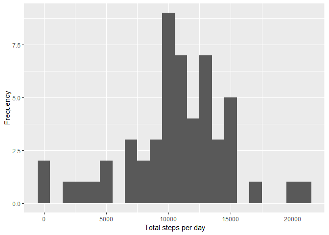
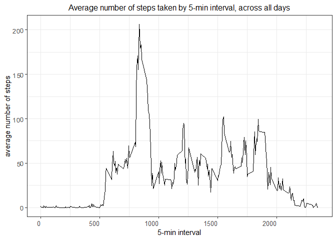
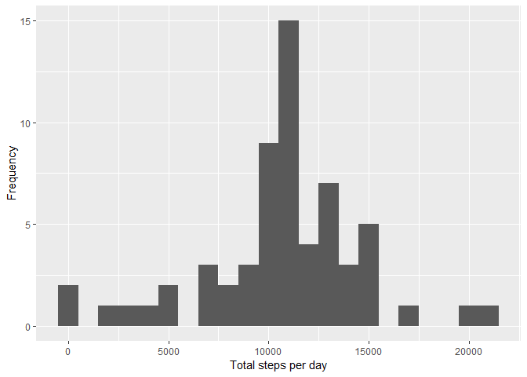
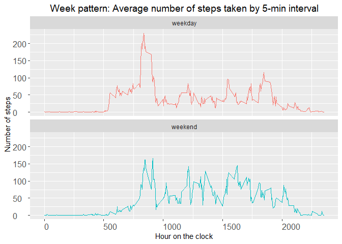

## Loading and preprocessing the data

1. Load the data

```r
unzip("./activity.zip")
activity <- read.csv("activity.csv")
```

2. Process/transform the data (if necessary) into a format suitable for your analysis

```r
str(activity)
```

```
## 'data.frame':	17568 obs. of  3 variables:
##  $ steps   : int  NA NA NA NA NA NA NA NA NA NA ...
##  $ date    : Factor w/ 61 levels "2012-10-01","2012-10-02",..: 1 1 1 1 1 1 1 1 1 1 ...
##  $ interval: int  0 5 10 15 20 25 30 35 40 45 ...
```

```r
activity$date <- as.Date(activity$date)
```


## What is mean total number of steps taken per day?

For this part of the assignment, you can ignore the missing values in the dataset.

1. Calculate the total number of steps taken per day

```r
library(dplyr)
library(ggplot2)
```

2. Make a histogram of the total number of steps taken each day

```r
stepsByDay <- tapply(activity$steps, activity$date, sum, na.rm=FALSE)
qplot(stepsByDay, xlab='Total steps per day', ylab='Frequency', binwidth=1000)
```

```
## Warning: Removed 8 rows containing non-finite values (stat_bin).
```

<!-- -->

3. Calculate and report the mean and median of the total number of steps taken per day

```r
summary(stepsByDay)
```

```
##    Min. 1st Qu.  Median    Mean 3rd Qu.    Max.    NA's 
##      41    8841   10765   10766   13294   21194       8
```

- Mean: **9354**
- Median: **10395**


## What is the average daily activity pattern?

1. Make a time series plot of the 5-minute interval (x-axis) and the average number of steps taken, averaged across all days (y-axis)


```r
interval.activity <- group_by(activity, interval)
interval.stats<- summarise(interval.activity, mean.steps = mean(steps, na.rm = TRUE))
```


```r
plot4 <- ggplot(interval.stats, aes(interval, mean.steps)) + geom_line() + 
        ggtitle("Average number of steps taken by 5-min interval, across all days") + 
        xlab("5-min interval") + ylab("average number of steps") + theme_bw() +
        theme(plot.title = element_text(size = 12, hjust = 0.5),
              axis.text.x = element_text(angle = 0, size = 10, hjust = 1),
              axis.text.y = element_text(angle = 2, size = 10, hjust = 1))
plot4
```

<!-- -->


2. Which 5-minute interval, on average across all the days in the dataset, contains the maximum number of steps?

```r
interval.stats[interval.stats$mean.steps == max(interval.stats$mean.steps),]
```

```
## # A tibble: 1 x 2
##   interval mean.steps
##      <int>      <dbl>
## 1      835       206.
```
- Most active interval: 835 min


## Imputing missing values


1. Calculate and report the total number of missing values in the dataset (i.e. the total number of rows with NAs).

```r
sum(is.na(activity$steps))
```

```
## [1] 2304
```

```r
sum(is.na(activity$date))
```

```
## [1] 0
```

```r
sum(is.na(activity$interval))
```

```
## [1] 0
```
- There are **2304** NA, all in the steps colunm.

2. Devise a strategy for filling in all of the missing values in the dataset. Create a new dataset that is equal to the original dataset but with the missing data filled in.

```r
for (i in 1:length(activity$interval)){
if(is.na(activity$steps[i]) == TRUE){
activity$steps[i] <- interval.stats$mean.steps[match(activity$interval[i], interval.stats$interval)]
        }
}
```


```r
summary(activity)
```

```
##      steps             date               interval     
##  Min.   :  0.00   Min.   :2012-10-01   Min.   :   0.0  
##  1st Qu.:  0.00   1st Qu.:2012-10-16   1st Qu.: 588.8  
##  Median :  0.00   Median :2012-10-31   Median :1177.5  
##  Mean   : 37.38   Mean   :2012-10-31   Mean   :1177.5  
##  3rd Qu.: 27.00   3rd Qu.:2012-11-15   3rd Qu.:1766.2  
##  Max.   :806.00   Max.   :2012-11-30   Max.   :2355.0
```

3. Make a histogram of the total number of steps taken each day and calculate and report the mean and median total number of steps taken per day. Do these values differ from the estimates from the first part of the assignment? What is the impact of imputing missing data on the estimates of the total daily number of steps?

```r
stepsByDay <- tapply(activity$steps, activity$date, sum, na.rm=TRUE)
qplot(stepsByDay, xlab='Total steps per day', ylab='Frequency', binwidth=1000)
```

<!-- -->


```r
summary(stepsByDay)
```

```
##    Min. 1st Qu.  Median    Mean 3rd Qu.    Max. 
##      41    9819   10766   10766   12811   21194
```

- Mean: **10766**
- Median: **10766**

*Do these values differ from the estimates from the first part of the assignment? What is the impact of imputing missing data on the estimates of the total daily number of steps?*

Yes. Many of the 0 records have changed, and the number of steps seems to be more distributed across intervals. The y-axis of both histograms has changed significantly.


## Are there differences in activity patterns between weekdays and weekends?


Use the dataset with the filled-in missing values for this part.

1. Create a new factor variable in the dataset with two levels - "weekday" and "weekend" indicating whether a given date is a weekday or weekend day.

```r
days <- weekdays(activity$date)
activity <- cbind(activity, days)
###
weekday <- c("Monday", "Tuesday", "Wednesday", "Thursday", "Friday")
weekend <- c("Saturday", "Sunday")

class.day <- c(1:17568)
activity <- cbind(activity, class.day)

activity$class.day[activity$days %in% weekday] <- "weekday"
activity$class.day[activity$days %in% weekend] <- "weekend"
activity$class.day <- as.factor(activity$class.day)
```

2. Make a panel plot containing a time series plot of the 5-minute interval (x-axis) and the average number of steps taken, averaged across all weekday days or weekend days (y-axis).


```r
activitytrend <- aggregate(steps ~ interval + class.day, data=activity, mean)

plot6 <- ggplot(activitytrend, aes(x = interval, y = steps, group = class.day)) + 
geom_line(aes(color = class.day), lwd = 0.5) + 
facet_wrap(~ class.day, nrow = 2) +
ggtitle("Week pattern: Average number of steps taken by 5-min interval") + 
labs(x = "Hour on the clock", y = "Number of steps") +
theme(plot.title = element_text(size = 14, hjust = 0.5),
axis.text.x = element_text(size = 12, hjust = 0),
axis.text.y = element_text(size = 12, hjust = 0),
legend.position = "none")

plot6
```

<!-- -->


