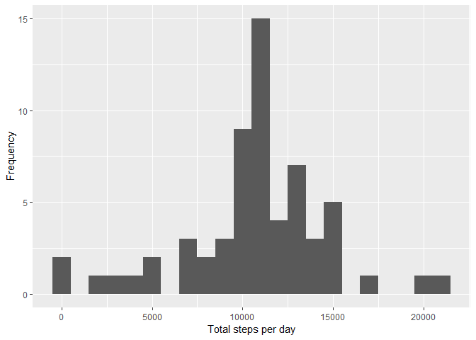

## Loading and preprocessing the data

1. Load the data (i.e. \color{red}{\verb|read.csv()|}read.csv())

```r
unzip("./activity.zip")
activity <- read.csv("activity.csv")
```

2. Process/transform the data (if necessary) into a format suitable for your analysis

```r
str(activity)
```

```
## 'data.frame':	17568 obs. of  3 variables:
##  $ steps   : int  NA NA NA NA NA NA NA NA NA NA ...
##  $ date    : Factor w/ 61 levels "2012-10-01","2012-10-02",..: 1 1 1 1 1 1 1 1 1 1 ...
##  $ interval: int  0 5 10 15 20 25 30 35 40 45 ...
```

```r
activity$date <- as.Date(activity$date)
```


## What is mean total number of steps taken per day?

For this part of the assignment, you can ignore the missing values in the dataset.

1. Calculate the total number of steps taken per day

```r
library(dplyr)
library(ggplot2)
```

2. Make a histogram of the total number of steps taken each day

```r
stepsByDay <- tapply(activity$steps, activity$date, sum, na.rm=FALSE)
qplot(stepsByDay, xlab='Total steps per day', ylab='Frequency', binwidth=1000)
```

```
## Warning: Removed 8 rows containing non-finite values (stat_bin).
```

<!-- -->

3. Calculate and report the mean and median of the total number of steps taken per day

```r
summary(stepsByDay)
```

```
##    Min. 1st Qu.  Median    Mean 3rd Qu.    Max.    NA's 
##      41    8841   10765   10766   13294   21194       8
```

- Mean: **9354**
- Median: **10395**


## What is the average daily activity pattern?

1. Make a time series plot of the 5-minute interval (x-axis) and the average number of steps taken, averaged across all days (y-axis)


```r
interval.activity <- group_by(activity, interval)
interval.stats<- summarise(interval.activity, mean.steps = mean(steps, na.rm = TRUE))
```


```r
library(plotly)
```


```r
plot4 <- ggplot(interval.stats, aes(interval, mean.steps)) + geom_line() + 
        ggtitle("Average number of steps taken by 5-min interval, across all days") + 
        xlab("5-min interval") + ylab("average number of steps") + theme_bw() +
        theme(plot.title = element_text(size = 12, hjust = 0.5),
              axis.text.x = element_text(angle = 0, size = 10, hjust = 1),
              axis.text.y = element_text(angle = 2, size = 10, hjust = 1))
plot4 <- ggplotly(plot4)
plot4
```

<!--html_preserve--><div id="htmlwidget-3dd25de811ff6163b111" style="width:672px;height:480px;" class="plotly html-widget"></div>
<script type="application/json" data-for="htmlwidget-3dd25de811ff6163b111">{"x":{"data":[{"x":[0,5,10,15,20,25,30,35,40,45,50,55,100,105,110,115,120,125,130,135,140,145,150,155,200,205,210,215,220,225,230,235,240,245,250,255,300,305,310,315,320,325,330,335,340,345,350,355,400,405,410,415,420,425,430,435,440,445,450,455,500,505,510,515,520,525,530,535,540,545,550,555,600,605,610,615,620,625,630,635,640,645,650,655,700,705,710,715,720,725,730,735,740,745,750,755,800,805,810,815,820,825,830,835,840,845,850,855,900,905,910,915,920,925,930,935,940,945,950,955,1000,1005,1010,1015,1020,1025,1030,1035,1040,1045,1050,1055,1100,1105,1110,1115,1120,1125,1130,1135,1140,1145,1150,1155,1200,1205,1210,1215,1220,1225,1230,1235,1240,1245,1250,1255,1300,1305,1310,1315,1320,1325,1330,1335,1340,1345,1350,1355,1400,1405,1410,1415,1420,1425,1430,1435,1440,1445,1450,1455,1500,1505,1510,1515,1520,1525,1530,1535,1540,1545,1550,1555,1600,1605,1610,1615,1620,1625,1630,1635,1640,1645,1650,1655,1700,1705,1710,1715,1720,1725,1730,1735,1740,1745,1750,1755,1800,1805,1810,1815,1820,1825,1830,1835,1840,1845,1850,1855,1900,1905,1910,1915,1920,1925,1930,1935,1940,1945,1950,1955,2000,2005,2010,2015,2020,2025,2030,2035,2040,2045,2050,2055,2100,2105,2110,2115,2120,2125,2130,2135,2140,2145,2150,2155,2200,2205,2210,2215,2220,2225,2230,2235,2240,2245,2250,2255,2300,2305,2310,2315,2320,2325,2330,2335,2340,2345,2350,2355],"y":[1.71698113207547,0.339622641509434,0.132075471698113,0.150943396226415,0.0754716981132075,2.09433962264151,0.528301886792453,0.867924528301887,0,1.47169811320755,0.30188679245283,0.132075471698113,0.320754716981132,0.679245283018868,0.150943396226415,0.339622641509434,0,1.11320754716981,1.83018867924528,0.169811320754717,0.169811320754717,0.377358490566038,0.264150943396226,0,0,0,1.13207547169811,0,0,0.132075471698113,0,0.226415094339623,0,0,1.54716981132075,0.943396226415094,0,0,0,0,0.207547169811321,0.622641509433962,1.62264150943396,0.584905660377358,0.490566037735849,0.0754716981132075,0,0,1.18867924528302,0.943396226415094,2.56603773584906,0,0.339622641509434,0.358490566037736,4.11320754716981,0.660377358490566,3.49056603773585,0.830188679245283,3.11320754716981,1.11320754716981,0,1.56603773584906,3,2.24528301886792,3.32075471698113,2.9622641509434,2.09433962264151,6.05660377358491,16.0188679245283,18.3396226415094,39.4528301886792,44.4905660377358,31.4905660377358,49.2641509433962,53.7735849056604,63.4528301886792,49.9622641509434,47.0754716981132,52.1509433962264,39.3396226415094,44.0188679245283,44.1698113207547,37.3584905660377,49.0377358490566,43.811320754717,44.377358490566,50.5094339622642,54.5094339622642,49.9245283018868,50.9811320754717,55.6792452830189,44.3207547169811,52.2641509433962,69.5471698113208,57.8490566037736,56.1509433962264,73.377358490566,68.2075471698113,129.433962264151,157.528301886792,171.150943396226,155.396226415094,177.301886792453,206.169811320755,195.924528301887,179.566037735849,183.396226415094,167.018867924528,143.452830188679,124.037735849057,109.11320754717,108.11320754717,103.716981132075,95.9622641509434,66.2075471698113,45.2264150943396,24.7924528301887,38.7547169811321,34.9811320754717,21.0566037735849,40.5660377358491,26.9811320754717,42.4150943396226,52.6603773584906,38.9245283018868,50.7924528301887,44.2830188679245,37.4150943396226,34.6981132075472,28.3396226415094,25.0943396226415,31.9433962264151,31.3584905660377,29.6792452830189,21.3207547169811,25.5471698113208,28.377358490566,26.4716981132075,33.4339622641509,49.9811320754717,42.0377358490566,44.6037735849057,46.0377358490566,59.188679245283,63.8679245283019,87.6981132075472,94.8490566037736,92.7735849056604,63.3962264150943,50.1698113207547,54.4716981132075,32.4150943396226,26.5283018867925,37.7358490566038,45.0566037735849,67.2830188679245,42.3396226415094,39.8867924528302,43.2641509433962,40.9811320754717,46.2452830188679,56.4339622641509,42.7547169811321,25.1320754716981,39.9622641509434,53.5471698113208,47.3207547169811,60.811320754717,55.7547169811321,51.9622641509434,43.5849056603774,48.6981132075472,35.4716981132075,37.5471698113208,41.8490566037736,27.5094339622642,17.1132075471698,26.0754716981132,43.622641509434,43.7735849056604,30.0188679245283,36.0754716981132,35.4905660377358,38.8490566037736,45.9622641509434,47.7547169811321,48.1320754716981,65.3207547169811,82.9056603773585,98.6603773584906,102.11320754717,83.9622641509434,62.1320754716981,64.1320754716981,74.5471698113208,63.1698113207547,56.9056603773585,59.7735849056604,43.8679245283019,38.5660377358491,44.6603773584906,45.4528301886792,46.2075471698113,43.6792452830189,46.622641509434,56.3018867924528,50.7169811320755,61.2264150943396,72.7169811320755,78.9433962264151,68.9433962264151,59.6603773584906,75.0943396226415,56.5094339622642,34.7735849056604,37.4528301886792,40.6792452830189,58.0188679245283,74.6981132075472,85.3207547169811,59.2641509433962,67.7735849056604,77.6981132075472,74.2452830188679,85.3396226415094,99.4528301886792,86.5849056603774,85.6037735849057,84.8679245283019,77.8301886792453,58.0377358490566,53.3584905660377,36.3207547169811,20.7169811320755,27.3962264150943,40.0188679245283,30.2075471698113,25.5471698113208,45.6603773584906,33.5283018867925,19.622641509434,19.0188679245283,19.3396226415094,33.3396226415094,26.811320754717,21.1698113207547,27.3018867924528,21.3396226415094,19.5471698113208,21.3207547169811,32.3018867924528,20.1509433962264,15.9433962264151,17.2264150943396,23.4528301886792,19.2452830188679,12.4528301886792,8.0188679245283,14.6603773584906,16.3018867924528,8.67924528301887,7.79245283018868,8.13207547169811,2.62264150943396,1.45283018867925,3.67924528301887,4.81132075471698,8.50943396226415,7.07547169811321,8.69811320754717,9.75471698113208,2.20754716981132,0.320754716981132,0.113207547169811,1.60377358490566,4.60377358490566,3.30188679245283,2.84905660377358,0,0.830188679245283,0.962264150943396,1.58490566037736,2.60377358490566,4.69811320754717,3.30188679245283,0.641509433962264,0.226415094339623,1.07547169811321],"text":["interval:    0<br />mean.steps:   1.7169811","interval:    5<br />mean.steps:   0.3396226","interval:   10<br />mean.steps:   0.1320755","interval:   15<br />mean.steps:   0.1509434","interval:   20<br />mean.steps:   0.0754717","interval:   25<br />mean.steps:   2.0943396","interval:   30<br />mean.steps:   0.5283019","interval:   35<br />mean.steps:   0.8679245","interval:   40<br />mean.steps:   0.0000000","interval:   45<br />mean.steps:   1.4716981","interval:   50<br />mean.steps:   0.3018868","interval:   55<br />mean.steps:   0.1320755","interval:  100<br />mean.steps:   0.3207547","interval:  105<br />mean.steps:   0.6792453","interval:  110<br />mean.steps:   0.1509434","interval:  115<br />mean.steps:   0.3396226","interval:  120<br />mean.steps:   0.0000000","interval:  125<br />mean.steps:   1.1132075","interval:  130<br />mean.steps:   1.8301887","interval:  135<br />mean.steps:   0.1698113","interval:  140<br />mean.steps:   0.1698113","interval:  145<br />mean.steps:   0.3773585","interval:  150<br />mean.steps:   0.2641509","interval:  155<br />mean.steps:   0.0000000","interval:  200<br />mean.steps:   0.0000000","interval:  205<br />mean.steps:   0.0000000","interval:  210<br />mean.steps:   1.1320755","interval:  215<br />mean.steps:   0.0000000","interval:  220<br />mean.steps:   0.0000000","interval:  225<br />mean.steps:   0.1320755","interval:  230<br />mean.steps:   0.0000000","interval:  235<br />mean.steps:   0.2264151","interval:  240<br />mean.steps:   0.0000000","interval:  245<br />mean.steps:   0.0000000","interval:  250<br />mean.steps:   1.5471698","interval:  255<br />mean.steps:   0.9433962","interval:  300<br />mean.steps:   0.0000000","interval:  305<br />mean.steps:   0.0000000","interval:  310<br />mean.steps:   0.0000000","interval:  315<br />mean.steps:   0.0000000","interval:  320<br />mean.steps:   0.2075472","interval:  325<br />mean.steps:   0.6226415","interval:  330<br />mean.steps:   1.6226415","interval:  335<br />mean.steps:   0.5849057","interval:  340<br />mean.steps:   0.4905660","interval:  345<br />mean.steps:   0.0754717","interval:  350<br />mean.steps:   0.0000000","interval:  355<br />mean.steps:   0.0000000","interval:  400<br />mean.steps:   1.1886792","interval:  405<br />mean.steps:   0.9433962","interval:  410<br />mean.steps:   2.5660377","interval:  415<br />mean.steps:   0.0000000","interval:  420<br />mean.steps:   0.3396226","interval:  425<br />mean.steps:   0.3584906","interval:  430<br />mean.steps:   4.1132075","interval:  435<br />mean.steps:   0.6603774","interval:  440<br />mean.steps:   3.4905660","interval:  445<br />mean.steps:   0.8301887","interval:  450<br />mean.steps:   3.1132075","interval:  455<br />mean.steps:   1.1132075","interval:  500<br />mean.steps:   0.0000000","interval:  505<br />mean.steps:   1.5660377","interval:  510<br />mean.steps:   3.0000000","interval:  515<br />mean.steps:   2.2452830","interval:  520<br />mean.steps:   3.3207547","interval:  525<br />mean.steps:   2.9622642","interval:  530<br />mean.steps:   2.0943396","interval:  535<br />mean.steps:   6.0566038","interval:  540<br />mean.steps:  16.0188679","interval:  545<br />mean.steps:  18.3396226","interval:  550<br />mean.steps:  39.4528302","interval:  555<br />mean.steps:  44.4905660","interval:  600<br />mean.steps:  31.4905660","interval:  605<br />mean.steps:  49.2641509","interval:  610<br />mean.steps:  53.7735849","interval:  615<br />mean.steps:  63.4528302","interval:  620<br />mean.steps:  49.9622642","interval:  625<br />mean.steps:  47.0754717","interval:  630<br />mean.steps:  52.1509434","interval:  635<br />mean.steps:  39.3396226","interval:  640<br />mean.steps:  44.0188679","interval:  645<br />mean.steps:  44.1698113","interval:  650<br />mean.steps:  37.3584906","interval:  655<br />mean.steps:  49.0377358","interval:  700<br />mean.steps:  43.8113208","interval:  705<br />mean.steps:  44.3773585","interval:  710<br />mean.steps:  50.5094340","interval:  715<br />mean.steps:  54.5094340","interval:  720<br />mean.steps:  49.9245283","interval:  725<br />mean.steps:  50.9811321","interval:  730<br />mean.steps:  55.6792453","interval:  735<br />mean.steps:  44.3207547","interval:  740<br />mean.steps:  52.2641509","interval:  745<br />mean.steps:  69.5471698","interval:  750<br />mean.steps:  57.8490566","interval:  755<br />mean.steps:  56.1509434","interval:  800<br />mean.steps:  73.3773585","interval:  805<br />mean.steps:  68.2075472","interval:  810<br />mean.steps: 129.4339623","interval:  815<br />mean.steps: 157.5283019","interval:  820<br />mean.steps: 171.1509434","interval:  825<br />mean.steps: 155.3962264","interval:  830<br />mean.steps: 177.3018868","interval:  835<br />mean.steps: 206.1698113","interval:  840<br />mean.steps: 195.9245283","interval:  845<br />mean.steps: 179.5660377","interval:  850<br />mean.steps: 183.3962264","interval:  855<br />mean.steps: 167.0188679","interval:  900<br />mean.steps: 143.4528302","interval:  905<br />mean.steps: 124.0377358","interval:  910<br />mean.steps: 109.1132075","interval:  915<br />mean.steps: 108.1132075","interval:  920<br />mean.steps: 103.7169811","interval:  925<br />mean.steps:  95.9622642","interval:  930<br />mean.steps:  66.2075472","interval:  935<br />mean.steps:  45.2264151","interval:  940<br />mean.steps:  24.7924528","interval:  945<br />mean.steps:  38.7547170","interval:  950<br />mean.steps:  34.9811321","interval:  955<br />mean.steps:  21.0566038","interval: 1000<br />mean.steps:  40.5660377","interval: 1005<br />mean.steps:  26.9811321","interval: 1010<br />mean.steps:  42.4150943","interval: 1015<br />mean.steps:  52.6603774","interval: 1020<br />mean.steps:  38.9245283","interval: 1025<br />mean.steps:  50.7924528","interval: 1030<br />mean.steps:  44.2830189","interval: 1035<br />mean.steps:  37.4150943","interval: 1040<br />mean.steps:  34.6981132","interval: 1045<br />mean.steps:  28.3396226","interval: 1050<br />mean.steps:  25.0943396","interval: 1055<br />mean.steps:  31.9433962","interval: 1100<br />mean.steps:  31.3584906","interval: 1105<br />mean.steps:  29.6792453","interval: 1110<br />mean.steps:  21.3207547","interval: 1115<br />mean.steps:  25.5471698","interval: 1120<br />mean.steps:  28.3773585","interval: 1125<br />mean.steps:  26.4716981","interval: 1130<br />mean.steps:  33.4339623","interval: 1135<br />mean.steps:  49.9811321","interval: 1140<br />mean.steps:  42.0377358","interval: 1145<br />mean.steps:  44.6037736","interval: 1150<br />mean.steps:  46.0377358","interval: 1155<br />mean.steps:  59.1886792","interval: 1200<br />mean.steps:  63.8679245","interval: 1205<br />mean.steps:  87.6981132","interval: 1210<br />mean.steps:  94.8490566","interval: 1215<br />mean.steps:  92.7735849","interval: 1220<br />mean.steps:  63.3962264","interval: 1225<br />mean.steps:  50.1698113","interval: 1230<br />mean.steps:  54.4716981","interval: 1235<br />mean.steps:  32.4150943","interval: 1240<br />mean.steps:  26.5283019","interval: 1245<br />mean.steps:  37.7358491","interval: 1250<br />mean.steps:  45.0566038","interval: 1255<br />mean.steps:  67.2830189","interval: 1300<br />mean.steps:  42.3396226","interval: 1305<br />mean.steps:  39.8867925","interval: 1310<br />mean.steps:  43.2641509","interval: 1315<br />mean.steps:  40.9811321","interval: 1320<br />mean.steps:  46.2452830","interval: 1325<br />mean.steps:  56.4339623","interval: 1330<br />mean.steps:  42.7547170","interval: 1335<br />mean.steps:  25.1320755","interval: 1340<br />mean.steps:  39.9622642","interval: 1345<br />mean.steps:  53.5471698","interval: 1350<br />mean.steps:  47.3207547","interval: 1355<br />mean.steps:  60.8113208","interval: 1400<br />mean.steps:  55.7547170","interval: 1405<br />mean.steps:  51.9622642","interval: 1410<br />mean.steps:  43.5849057","interval: 1415<br />mean.steps:  48.6981132","interval: 1420<br />mean.steps:  35.4716981","interval: 1425<br />mean.steps:  37.5471698","interval: 1430<br />mean.steps:  41.8490566","interval: 1435<br />mean.steps:  27.5094340","interval: 1440<br />mean.steps:  17.1132075","interval: 1445<br />mean.steps:  26.0754717","interval: 1450<br />mean.steps:  43.6226415","interval: 1455<br />mean.steps:  43.7735849","interval: 1500<br />mean.steps:  30.0188679","interval: 1505<br />mean.steps:  36.0754717","interval: 1510<br />mean.steps:  35.4905660","interval: 1515<br />mean.steps:  38.8490566","interval: 1520<br />mean.steps:  45.9622642","interval: 1525<br />mean.steps:  47.7547170","interval: 1530<br />mean.steps:  48.1320755","interval: 1535<br />mean.steps:  65.3207547","interval: 1540<br />mean.steps:  82.9056604","interval: 1545<br />mean.steps:  98.6603774","interval: 1550<br />mean.steps: 102.1132075","interval: 1555<br />mean.steps:  83.9622642","interval: 1600<br />mean.steps:  62.1320755","interval: 1605<br />mean.steps:  64.1320755","interval: 1610<br />mean.steps:  74.5471698","interval: 1615<br />mean.steps:  63.1698113","interval: 1620<br />mean.steps:  56.9056604","interval: 1625<br />mean.steps:  59.7735849","interval: 1630<br />mean.steps:  43.8679245","interval: 1635<br />mean.steps:  38.5660377","interval: 1640<br />mean.steps:  44.6603774","interval: 1645<br />mean.steps:  45.4528302","interval: 1650<br />mean.steps:  46.2075472","interval: 1655<br />mean.steps:  43.6792453","interval: 1700<br />mean.steps:  46.6226415","interval: 1705<br />mean.steps:  56.3018868","interval: 1710<br />mean.steps:  50.7169811","interval: 1715<br />mean.steps:  61.2264151","interval: 1720<br />mean.steps:  72.7169811","interval: 1725<br />mean.steps:  78.9433962","interval: 1730<br />mean.steps:  68.9433962","interval: 1735<br />mean.steps:  59.6603774","interval: 1740<br />mean.steps:  75.0943396","interval: 1745<br />mean.steps:  56.5094340","interval: 1750<br />mean.steps:  34.7735849","interval: 1755<br />mean.steps:  37.4528302","interval: 1800<br />mean.steps:  40.6792453","interval: 1805<br />mean.steps:  58.0188679","interval: 1810<br />mean.steps:  74.6981132","interval: 1815<br />mean.steps:  85.3207547","interval: 1820<br />mean.steps:  59.2641509","interval: 1825<br />mean.steps:  67.7735849","interval: 1830<br />mean.steps:  77.6981132","interval: 1835<br />mean.steps:  74.2452830","interval: 1840<br />mean.steps:  85.3396226","interval: 1845<br />mean.steps:  99.4528302","interval: 1850<br />mean.steps:  86.5849057","interval: 1855<br />mean.steps:  85.6037736","interval: 1900<br />mean.steps:  84.8679245","interval: 1905<br />mean.steps:  77.8301887","interval: 1910<br />mean.steps:  58.0377358","interval: 1915<br />mean.steps:  53.3584906","interval: 1920<br />mean.steps:  36.3207547","interval: 1925<br />mean.steps:  20.7169811","interval: 1930<br />mean.steps:  27.3962264","interval: 1935<br />mean.steps:  40.0188679","interval: 1940<br />mean.steps:  30.2075472","interval: 1945<br />mean.steps:  25.5471698","interval: 1950<br />mean.steps:  45.6603774","interval: 1955<br />mean.steps:  33.5283019","interval: 2000<br />mean.steps:  19.6226415","interval: 2005<br />mean.steps:  19.0188679","interval: 2010<br />mean.steps:  19.3396226","interval: 2015<br />mean.steps:  33.3396226","interval: 2020<br />mean.steps:  26.8113208","interval: 2025<br />mean.steps:  21.1698113","interval: 2030<br />mean.steps:  27.3018868","interval: 2035<br />mean.steps:  21.3396226","interval: 2040<br />mean.steps:  19.5471698","interval: 2045<br />mean.steps:  21.3207547","interval: 2050<br />mean.steps:  32.3018868","interval: 2055<br />mean.steps:  20.1509434","interval: 2100<br />mean.steps:  15.9433962","interval: 2105<br />mean.steps:  17.2264151","interval: 2110<br />mean.steps:  23.4528302","interval: 2115<br />mean.steps:  19.2452830","interval: 2120<br />mean.steps:  12.4528302","interval: 2125<br />mean.steps:   8.0188679","interval: 2130<br />mean.steps:  14.6603774","interval: 2135<br />mean.steps:  16.3018868","interval: 2140<br />mean.steps:   8.6792453","interval: 2145<br />mean.steps:   7.7924528","interval: 2150<br />mean.steps:   8.1320755","interval: 2155<br />mean.steps:   2.6226415","interval: 2200<br />mean.steps:   1.4528302","interval: 2205<br />mean.steps:   3.6792453","interval: 2210<br />mean.steps:   4.8113208","interval: 2215<br />mean.steps:   8.5094340","interval: 2220<br />mean.steps:   7.0754717","interval: 2225<br />mean.steps:   8.6981132","interval: 2230<br />mean.steps:   9.7547170","interval: 2235<br />mean.steps:   2.2075472","interval: 2240<br />mean.steps:   0.3207547","interval: 2245<br />mean.steps:   0.1132075","interval: 2250<br />mean.steps:   1.6037736","interval: 2255<br />mean.steps:   4.6037736","interval: 2300<br />mean.steps:   3.3018868","interval: 2305<br />mean.steps:   2.8490566","interval: 2310<br />mean.steps:   0.0000000","interval: 2315<br />mean.steps:   0.8301887","interval: 2320<br />mean.steps:   0.9622642","interval: 2325<br />mean.steps:   1.5849057","interval: 2330<br />mean.steps:   2.6037736","interval: 2335<br />mean.steps:   4.6981132","interval: 2340<br />mean.steps:   3.3018868","interval: 2345<br />mean.steps:   0.6415094","interval: 2350<br />mean.steps:   0.2264151","interval: 2355<br />mean.steps:   1.0754717"],"type":"scatter","mode":"lines","line":{"width":1.88976377952756,"color":"rgba(0,0,0,1)","dash":"solid"},"hoveron":"points","showlegend":false,"xaxis":"x","yaxis":"y","hoverinfo":"text","frame":null}],"layout":{"margin":{"t":42.1685346616853,"r":7.30593607305936,"b":41.7766708177667,"l":45.4960564549606},"plot_bgcolor":"rgba(255,255,255,1)","paper_bgcolor":"rgba(255,255,255,1)","font":{"color":"rgba(0,0,0,1)","family":"","size":14.6118721461187},"title":"Average number of steps taken by 5-min interval, across all days","titlefont":{"color":"rgba(0,0,0,1)","family":"","size":15.9402241594022},"xaxis":{"domain":[0,1],"automargin":true,"type":"linear","autorange":false,"range":[-117.75,2472.75],"tickmode":"array","ticktext":["0","500","1000","1500","2000"],"tickvals":[0,500,1000,1500,2000],"categoryorder":"array","categoryarray":["0","500","1000","1500","2000"],"nticks":null,"ticks":"outside","tickcolor":"rgba(51,51,51,1)","ticklen":3.65296803652968,"tickwidth":0.66417600664176,"showticklabels":true,"tickfont":{"color":"rgba(77,77,77,1)","family":"","size":13.2835201328352},"tickangle":-0,"showline":false,"linecolor":null,"linewidth":0,"showgrid":true,"gridcolor":"rgba(235,235,235,1)","gridwidth":0.66417600664176,"zeroline":false,"anchor":"y","title":"5-min interval","titlefont":{"color":"rgba(0,0,0,1)","family":"","size":14.6118721461187},"hoverformat":".2f"},"yaxis":{"domain":[0,1],"automargin":true,"type":"linear","autorange":false,"range":[-10.3084905660377,216.478301886792],"tickmode":"array","ticktext":["0","50","100","150","200"],"tickvals":[0,50,100,150,200],"categoryorder":"array","categoryarray":["0","50","100","150","200"],"nticks":null,"ticks":"outside","tickcolor":"rgba(51,51,51,1)","ticklen":3.65296803652968,"tickwidth":0.66417600664176,"showticklabels":true,"tickfont":{"color":"rgba(77,77,77,1)","family":"","size":13.2835201328352},"tickangle":-2,"showline":false,"linecolor":null,"linewidth":0,"showgrid":true,"gridcolor":"rgba(235,235,235,1)","gridwidth":0.66417600664176,"zeroline":false,"anchor":"x","title":"average number of steps","titlefont":{"color":"rgba(0,0,0,1)","family":"","size":14.6118721461187},"hoverformat":".2f"},"shapes":[{"type":"rect","fillcolor":"transparent","line":{"color":"rgba(51,51,51,1)","width":0.66417600664176,"linetype":"solid"},"yref":"paper","xref":"paper","x0":0,"x1":1,"y0":0,"y1":1}],"showlegend":false,"legend":{"bgcolor":"rgba(255,255,255,1)","bordercolor":"transparent","borderwidth":1.88976377952756,"font":{"color":"rgba(0,0,0,1)","family":"","size":11.689497716895}},"hovermode":"closest","barmode":"relative"},"config":{"doubleClick":"reset","modeBarButtonsToAdd":[{"name":"Collaborate","icon":{"width":1000,"ascent":500,"descent":-50,"path":"M487 375c7-10 9-23 5-36l-79-259c-3-12-11-23-22-31-11-8-22-12-35-12l-263 0c-15 0-29 5-43 15-13 10-23 23-28 37-5 13-5 25-1 37 0 0 0 3 1 7 1 5 1 8 1 11 0 2 0 4-1 6 0 3-1 5-1 6 1 2 2 4 3 6 1 2 2 4 4 6 2 3 4 5 5 7 5 7 9 16 13 26 4 10 7 19 9 26 0 2 0 5 0 9-1 4-1 6 0 8 0 2 2 5 4 8 3 3 5 5 5 7 4 6 8 15 12 26 4 11 7 19 7 26 1 1 0 4 0 9-1 4-1 7 0 8 1 2 3 5 6 8 4 4 6 6 6 7 4 5 8 13 13 24 4 11 7 20 7 28 1 1 0 4 0 7-1 3-1 6-1 7 0 2 1 4 3 6 1 1 3 4 5 6 2 3 3 5 5 6 1 2 3 5 4 9 2 3 3 7 5 10 1 3 2 6 4 10 2 4 4 7 6 9 2 3 4 5 7 7 3 2 7 3 11 3 3 0 8 0 13-1l0-1c7 2 12 2 14 2l218 0c14 0 25-5 32-16 8-10 10-23 6-37l-79-259c-7-22-13-37-20-43-7-7-19-10-37-10l-248 0c-5 0-9-2-11-5-2-3-2-7 0-12 4-13 18-20 41-20l264 0c5 0 10 2 16 5 5 3 8 6 10 11l85 282c2 5 2 10 2 17 7-3 13-7 17-13z m-304 0c-1-3-1-5 0-7 1-1 3-2 6-2l174 0c2 0 4 1 7 2 2 2 4 4 5 7l6 18c0 3 0 5-1 7-1 1-3 2-6 2l-173 0c-3 0-5-1-8-2-2-2-4-4-4-7z m-24-73c-1-3-1-5 0-7 2-2 3-2 6-2l174 0c2 0 5 0 7 2 3 2 4 4 5 7l6 18c1 2 0 5-1 6-1 2-3 3-5 3l-174 0c-3 0-5-1-7-3-3-1-4-4-5-6z"},"click":"function(gd) { \n        // is this being viewed in RStudio?\n        if (location.search == '?viewer_pane=1') {\n          alert('To learn about plotly for collaboration, visit:\\n https://cpsievert.github.io/plotly_book/plot-ly-for-collaboration.html');\n        } else {\n          window.open('https://cpsievert.github.io/plotly_book/plot-ly-for-collaboration.html', '_blank');\n        }\n      }"}],"cloud":false},"source":"A","attrs":{"2d48c1a77b7":{"x":{},"y":{},"type":"scatter"}},"cur_data":"2d48c1a77b7","visdat":{"2d48c1a77b7":["function (y) ","x"]},"highlight":{"on":"plotly_click","persistent":false,"dynamic":false,"selectize":false,"opacityDim":0.2,"selected":{"opacity":1},"debounce":0},"base_url":"https://plot.ly"},"evals":["config.modeBarButtonsToAdd.0.click"],"jsHooks":[]}</script><!--/html_preserve-->


2. Which 5-minute interval, on average across all the days in the dataset, contains the maximum number of steps?

```r
interval.stats[interval.stats$mean.steps == max(interval.stats$mean.steps),]
```

```
## # A tibble: 1 x 2
##   interval mean.steps
##      <int>      <dbl>
## 1      835       206.
```
- Most active interval: 835 min


## Imputing missing values


1. Calculate and report the total number of missing values in the dataset (i.e. the total number of rows with NAs).

```r
sum(is.na(activity$steps))
```

```
## [1] 2304
```

```r
sum(is.na(activity$date))
```

```
## [1] 0
```

```r
sum(is.na(activity$interval))
```

```
## [1] 0
```
- There are **2304** NA, all in the steps colunm.

2. Devise a strategy for filling in all of the missing values in the dataset. Create a new dataset that is equal to the original dataset but with the missing data filled in.

```r
for (i in 1:length(activity$interval)){
if(is.na(activity$steps[i]) == TRUE){
activity$steps[i] <- interval.stats$mean.steps[match(activity$interval[i], interval.stats$interval)]
        }
}
```


```r
summary(activity)
```

```
##      steps             date               interval     
##  Min.   :  0.00   Min.   :2012-10-01   Min.   :   0.0  
##  1st Qu.:  0.00   1st Qu.:2012-10-16   1st Qu.: 588.8  
##  Median :  0.00   Median :2012-10-31   Median :1177.5  
##  Mean   : 37.38   Mean   :2012-10-31   Mean   :1177.5  
##  3rd Qu.: 27.00   3rd Qu.:2012-11-15   3rd Qu.:1766.2  
##  Max.   :806.00   Max.   :2012-11-30   Max.   :2355.0
```

3. Make a histogram of the total number of steps taken each day and calculate and report the mean and median total number of steps taken per day. Do these values differ from the estimates from the first part of the assignment? What is the impact of imputing missing data on the estimates of the total daily number of steps?

```r
stepsByDay <- tapply(activity$steps, activity$date, sum, na.rm=TRUE)
qplot(stepsByDay, xlab='Total steps per day', ylab='Frequency', binwidth=1000)
```

<!-- -->


```r
summary(stepsByDay)
```

```
##    Min. 1st Qu.  Median    Mean 3rd Qu.    Max. 
##      41    9819   10766   10766   12811   21194
```

- Mean: **10766**
- Median: **10766**

*Do these values differ from the estimates from the first part of the assignment? What is the impact of imputing missing data on the estimates of the total daily number of steps?*

Yes. Many of the 0 records have changed, and the number of steps seems to be more distributed across intervals. The y-axis of both histograms has changed significantly.


## Are there differences in activity patterns between weekdays and weekends?


Use the dataset with the filled-in missing values for this part.

1. Create a new factor variable in the dataset with two levels - "weekday" and "weekend" indicating whether a given date is a weekday or weekend day.

```r
days <- weekdays(activity$date)
activity <- cbind(activity, days)
###
weekday <- c("Monday", "Tuesday", "Wednesday", "Thursday", "Friday")
weekend <- c("Saturday", "Sunday")

class.day <- c(1:17568)
activity <- cbind(activity, class.day)

activity$class.day[activity$days %in% weekday] <- "weekday"
activity$class.day[activity$days %in% weekend] <- "weekend"
activity$class.day <- as.factor(activity$class.day)
```

2. Make a panel plot containing a time series plot of the 5-minute interval (x-axis) and the average number of steps taken, averaged across all weekday days or weekend days (y-axis).


```r
activitytrend <- aggregate(steps ~ interval + class.day, data=activity, mean)

plot6 <- ggplot(activitytrend, aes(x = interval, y = steps, group = class.day)) + 
geom_line(aes(color = class.day), lwd = 0.5) + 
facet_wrap(~ class.day, nrow = 2) +
ggtitle("Week pattern: Average number of steps taken by 5-min interval") + 
labs(x = "Hour on the clock", y = "Number of steps") +
theme(plot.title = element_text(size = 14, hjust = 0.5),
axis.text.x = element_text(size = 12, hjust = 0),
axis.text.y = element_text(size = 12, hjust = 0),
legend.position = "none")

plot6 <- ggplotly(plot6)
plot6
```

<!--html_preserve--><div id="htmlwidget-5cc35687daa4faff2cb1" style="width:672px;height:480px;" class="plotly html-widget"></div>
<script type="application/json" data-for="htmlwidget-5cc35687daa4faff2cb1">{"x":{"data":[{"x":[0,5,10,15,20,25,30,35,40,45,50,55,100,105,110,115,120,125,130,135,140,145,150,155,200,205,210,215,220,225,230,235,240,245,250,255,300,305,310,315,320,325,330,335,340,345,350,355,400,405,410,415,420,425,430,435,440,445,450,455,500,505,510,515,520,525,530,535,540,545,550,555,600,605,610,615,620,625,630,635,640,645,650,655,700,705,710,715,720,725,730,735,740,745,750,755,800,805,810,815,820,825,830,835,840,845,850,855,900,905,910,915,920,925,930,935,940,945,950,955,1000,1005,1010,1015,1020,1025,1030,1035,1040,1045,1050,1055,1100,1105,1110,1115,1120,1125,1130,1135,1140,1145,1150,1155,1200,1205,1210,1215,1220,1225,1230,1235,1240,1245,1250,1255,1300,1305,1310,1315,1320,1325,1330,1335,1340,1345,1350,1355,1400,1405,1410,1415,1420,1425,1430,1435,1440,1445,1450,1455,1500,1505,1510,1515,1520,1525,1530,1535,1540,1545,1550,1555,1600,1605,1610,1615,1620,1625,1630,1635,1640,1645,1650,1655,1700,1705,1710,1715,1720,1725,1730,1735,1740,1745,1750,1755,1800,1805,1810,1815,1820,1825,1830,1835,1840,1845,1850,1855,1900,1905,1910,1915,1920,1925,1930,1935,1940,1945,1950,1955,2000,2005,2010,2015,2020,2025,2030,2035,2040,2045,2050,2055,2100,2105,2110,2115,2120,2125,2130,2135,2140,2145,2150,2155,2200,2205,2210,2215,2220,2225,2230,2235,2240,2245,2250,2255,2300,2305,2310,2315,2320,2325,2330,2335,2340,2345,2350,2355],"y":[2.25115303983228,0.445283018867925,0.173165618448637,0.1979035639413,0.0989517819706499,1.59035639412998,0.692662473794549,1.13794549266247,0,1.79622641509434,0.3958071278826,0.0176100628930818,0.420545073375262,0.0905660377358491,0.1979035639413,0.445283018867925,0,1.45953878406709,2.22180293501048,0.0226415094339623,0.222641509433962,0.250314465408805,0.346331236897275,0,0,0,1.39538784067086,0,0,0.173165618448637,0,0.29685534591195,0,0,2.02851153039832,1.23689727463312,0,0,0,0,0.0276729559748428,0.816352201257862,1.23857442348008,0.522431865828092,0.420964360587002,0.0989517819706499,0,0,0.269601677148847,1.23689727463312,2.23102725366876,0,0.445283018867925,0.0477987421383648,3.3706498951782,0.221383647798742,3.77651991614256,0.888469601677149,2.34842767295597,0.726205450733753,0,2.05324947589099,3.93333333333333,2.18825995807128,4.22054507337526,2.70607966457023,2.74591194968553,7.94088050314465,20.4025157232704,23.6452830188679,50.3492662473795,56.2654088050314,41.2876310272537,64.5907756813417,70.0809224318658,77.1492662473795,63.9283018867925,60.032285115304,66.4423480083857,47.9786163522013,55.6691823899371,54.8670859538784,47.0477987421384,60.4272536687631,50.5970649895178,50.8280922431866,62.0234800838574,69.3345911949686,63.1010482180293,59.1085953878407,66.2238993710692,54.3538784067086,62.7241090146751,83.3840670859539,67.735429769392,66.5756813417191,82.7169811320755,71.9610062893082,144.013417190776,181.981551362683,200.575681341719,183.608385744235,198.884696016771,230.37819706499,218.901048218029,185.653249475891,191.230607966457,177.091404612159,167.660377358491,125.782809224319,93.948427672956,87.3039832285115,103.540041928721,92.4616352201258,58.5165618448637,35.8524109014675,27.461215932914,40.8561844863732,39.1308176100629,17.6297693920335,37.8754716981132,18.2197064989518,39.0775681341719,47.8213836477987,30.3454926624738,35.1501048218029,33.1266247379455,24.2553459119497,23.5153039832285,25.9119496855346,22.0348008385744,23.2591194968553,21.6922431865828,25.0905660377359,11.6872117400419,16.2729559748428,24.1836477987421,23.7295597484277,32.7689727463312,50.1974842767296,44.5605870020964,47.9249475890985,50.116142557652,56.1362683438155,55.7157232704403,72.8486373165618,83.6465408805031,75.2809224318658,48.7194968553459,46.822641509434,62.5740041928721,30.7442348008386,21.9815513626834,29.3203354297694,32.7853249475891,56.5932914046122,24.6008385744235,25.7404612159329,24.5685534591195,15.641928721174,35.6327044025157,44.8578616352201,31.7672955974843,23.306498951782,25.2394129979036,40.1840670859539,25.5761006289308,36.3303983228512,46.9228511530398,39.5505241090147,32.1224318658281,45.0486373165618,27.4851153039832,30.7618448637317,31.4909853249476,14.5123689727463,11.548427672956,21.9878406708595,41.8607966457023,38.2809224318658,30.8691823899371,35.0545073375262,29.9542976939203,31.9132075471698,39.8616352201258,37.3450733752621,42.1287211740042,50.9316561844864,90.5651991614256,95.8658280922432,93.948427672956,70.3060796645702,46.8842767295598,45.1953878406709,56.6062893081761,36.1337526205451,26.80964360587,29.5253668763103,22.5157232704403,21.8310272536688,25.8658280922432,31.9937106918239,27.6276729559748,32.4238993710692,23.5719077568134,44.9513626834382,34.1844863731656,48.0746331236897,60.1178197064989,72.3702306079665,56.1480083857442,65.8213836477987,82.8792452830189,59.3345911949686,34.5031446540881,37.5937106918239,26.6461215932914,46.6247379454927,67.2264150943396,82.6427672955975,61.3907756813417,73.4587002096436,79.2264150943396,81.4993710691824,91.7119496855346,115.460377358491,101.300209643606,90.5916142557652,87.5601677148847,77.2218029350105,62.3828092243187,54.3811320754717,37.8872117400419,20.5622641509434,29.0972746331237,45.9802935010482,30.0498951781971,18.5840670859539,44.2658280922432,27.2926624737946,13.3941299790356,5.558071278826,6.8230607966457,14.1119496855346,8.70817610062893,5.71153039832285,9.77358490566038,7.15639412997904,8.96184486373166,13.1094339622642,25.9735849056604,17.3090146750524,11.3702306079665,18.8968553459119,28.504821802935,18.9438155136268,14.2825995807128,8.04696016771488,12.7991614255765,16.5069182389937,7.13501048218029,7.59454926624738,8.26205450733753,3.43857442348008,1.52704402515723,4.42389937106918,6.30817610062893,11.1568134171908,9.27672955974843,10.8486373165618,12.7895178197065,2.89433962264151,0.0427672955974843,0.148427672955975,1.90272536687631,2.01383647798742,3.55136268343816,3.73542976939203,0,1.08846960167715,1.26163522012579,1.87798742138365,3.03605870020964,2.24863731656184,2.24025157232704,0.263312368972746,0.29685534591195,1.41006289308176],"text":["class.day: weekday<br />interval:    0<br />steps: 2.251153e+00<br />class.day: weekday","class.day: weekday<br />interval:    5<br />steps: 4.452830e-01<br />class.day: weekday","class.day: weekday<br />interval:   10<br />steps: 1.731656e-01<br />class.day: weekday","class.day: weekday<br />interval:   15<br />steps: 1.979036e-01<br />class.day: weekday","class.day: weekday<br />interval:   20<br />steps: 9.895178e-02<br />class.day: weekday","class.day: weekday<br />interval:   25<br />steps: 1.590356e+00<br />class.day: weekday","class.day: weekday<br />interval:   30<br />steps: 6.926625e-01<br />class.day: weekday","class.day: weekday<br />interval:   35<br />steps: 1.137945e+00<br />class.day: weekday","class.day: weekday<br />interval:   40<br />steps: 0.000000e+00<br />class.day: weekday","class.day: weekday<br />interval:   45<br />steps: 1.796226e+00<br />class.day: weekday","class.day: weekday<br />interval:   50<br />steps: 3.958071e-01<br />class.day: weekday","class.day: weekday<br />interval:   55<br />steps: 1.761006e-02<br />class.day: weekday","class.day: weekday<br />interval:  100<br />steps: 4.205451e-01<br />class.day: weekday","class.day: weekday<br />interval:  105<br />steps: 9.056604e-02<br />class.day: weekday","class.day: weekday<br />interval:  110<br />steps: 1.979036e-01<br />class.day: weekday","class.day: weekday<br />interval:  115<br />steps: 4.452830e-01<br />class.day: weekday","class.day: weekday<br />interval:  120<br />steps: 0.000000e+00<br />class.day: weekday","class.day: weekday<br />interval:  125<br />steps: 1.459539e+00<br />class.day: weekday","class.day: weekday<br />interval:  130<br />steps: 2.221803e+00<br />class.day: weekday","class.day: weekday<br />interval:  135<br />steps: 2.264151e-02<br />class.day: weekday","class.day: weekday<br />interval:  140<br />steps: 2.226415e-01<br />class.day: weekday","class.day: weekday<br />interval:  145<br />steps: 2.503145e-01<br />class.day: weekday","class.day: weekday<br />interval:  150<br />steps: 3.463312e-01<br />class.day: weekday","class.day: weekday<br />interval:  155<br />steps: 0.000000e+00<br />class.day: weekday","class.day: weekday<br />interval:  200<br />steps: 0.000000e+00<br />class.day: weekday","class.day: weekday<br />interval:  205<br />steps: 0.000000e+00<br />class.day: weekday","class.day: weekday<br />interval:  210<br />steps: 1.395388e+00<br />class.day: weekday","class.day: weekday<br />interval:  215<br />steps: 0.000000e+00<br />class.day: weekday","class.day: weekday<br />interval:  220<br />steps: 0.000000e+00<br />class.day: weekday","class.day: weekday<br />interval:  225<br />steps: 1.731656e-01<br />class.day: weekday","class.day: weekday<br />interval:  230<br />steps: 0.000000e+00<br />class.day: weekday","class.day: weekday<br />interval:  235<br />steps: 2.968553e-01<br />class.day: weekday","class.day: weekday<br />interval:  240<br />steps: 0.000000e+00<br />class.day: weekday","class.day: weekday<br />interval:  245<br />steps: 0.000000e+00<br />class.day: weekday","class.day: weekday<br />interval:  250<br />steps: 2.028512e+00<br />class.day: weekday","class.day: weekday<br />interval:  255<br />steps: 1.236897e+00<br />class.day: weekday","class.day: weekday<br />interval:  300<br />steps: 0.000000e+00<br />class.day: weekday","class.day: weekday<br />interval:  305<br />steps: 0.000000e+00<br />class.day: weekday","class.day: weekday<br />interval:  310<br />steps: 0.000000e+00<br />class.day: weekday","class.day: weekday<br />interval:  315<br />steps: 0.000000e+00<br />class.day: weekday","class.day: weekday<br />interval:  320<br />steps: 2.767296e-02<br />class.day: weekday","class.day: weekday<br />interval:  325<br />steps: 8.163522e-01<br />class.day: weekday","class.day: weekday<br />interval:  330<br />steps: 1.238574e+00<br />class.day: weekday","class.day: weekday<br />interval:  335<br />steps: 5.224319e-01<br />class.day: weekday","class.day: weekday<br />interval:  340<br />steps: 4.209644e-01<br />class.day: weekday","class.day: weekday<br />interval:  345<br />steps: 9.895178e-02<br />class.day: weekday","class.day: weekday<br />interval:  350<br />steps: 0.000000e+00<br />class.day: weekday","class.day: weekday<br />interval:  355<br />steps: 0.000000e+00<br />class.day: weekday","class.day: weekday<br />interval:  400<br />steps: 2.696017e-01<br />class.day: weekday","class.day: weekday<br />interval:  405<br />steps: 1.236897e+00<br />class.day: weekday","class.day: weekday<br />interval:  410<br />steps: 2.231027e+00<br />class.day: weekday","class.day: weekday<br />interval:  415<br />steps: 0.000000e+00<br />class.day: weekday","class.day: weekday<br />interval:  420<br />steps: 4.452830e-01<br />class.day: weekday","class.day: weekday<br />interval:  425<br />steps: 4.779874e-02<br />class.day: weekday","class.day: weekday<br />interval:  430<br />steps: 3.370650e+00<br />class.day: weekday","class.day: weekday<br />interval:  435<br />steps: 2.213836e-01<br />class.day: weekday","class.day: weekday<br />interval:  440<br />steps: 3.776520e+00<br />class.day: weekday","class.day: weekday<br />interval:  445<br />steps: 8.884696e-01<br />class.day: weekday","class.day: weekday<br />interval:  450<br />steps: 2.348428e+00<br />class.day: weekday","class.day: weekday<br />interval:  455<br />steps: 7.262055e-01<br />class.day: weekday","class.day: weekday<br />interval:  500<br />steps: 0.000000e+00<br />class.day: weekday","class.day: weekday<br />interval:  505<br />steps: 2.053249e+00<br />class.day: weekday","class.day: weekday<br />interval:  510<br />steps: 3.933333e+00<br />class.day: weekday","class.day: weekday<br />interval:  515<br />steps: 2.188260e+00<br />class.day: weekday","class.day: weekday<br />interval:  520<br />steps: 4.220545e+00<br />class.day: weekday","class.day: weekday<br />interval:  525<br />steps: 2.706080e+00<br />class.day: weekday","class.day: weekday<br />interval:  530<br />steps: 2.745912e+00<br />class.day: weekday","class.day: weekday<br />interval:  535<br />steps: 7.940881e+00<br />class.day: weekday","class.day: weekday<br />interval:  540<br />steps: 2.040252e+01<br />class.day: weekday","class.day: weekday<br />interval:  545<br />steps: 2.364528e+01<br />class.day: weekday","class.day: weekday<br />interval:  550<br />steps: 5.034927e+01<br />class.day: weekday","class.day: weekday<br />interval:  555<br />steps: 5.626541e+01<br />class.day: weekday","class.day: weekday<br />interval:  600<br />steps: 4.128763e+01<br />class.day: weekday","class.day: weekday<br />interval:  605<br />steps: 6.459078e+01<br />class.day: weekday","class.day: weekday<br />interval:  610<br />steps: 7.008092e+01<br />class.day: weekday","class.day: weekday<br />interval:  615<br />steps: 7.714927e+01<br />class.day: weekday","class.day: weekday<br />interval:  620<br />steps: 6.392830e+01<br />class.day: weekday","class.day: weekday<br />interval:  625<br />steps: 6.003229e+01<br />class.day: weekday","class.day: weekday<br />interval:  630<br />steps: 6.644235e+01<br />class.day: weekday","class.day: weekday<br />interval:  635<br />steps: 4.797862e+01<br />class.day: weekday","class.day: weekday<br />interval:  640<br />steps: 5.566918e+01<br />class.day: weekday","class.day: weekday<br />interval:  645<br />steps: 5.486709e+01<br />class.day: weekday","class.day: weekday<br />interval:  650<br />steps: 4.704780e+01<br />class.day: weekday","class.day: weekday<br />interval:  655<br />steps: 6.042725e+01<br />class.day: weekday","class.day: weekday<br />interval:  700<br />steps: 5.059706e+01<br />class.day: weekday","class.day: weekday<br />interval:  705<br />steps: 5.082809e+01<br />class.day: weekday","class.day: weekday<br />interval:  710<br />steps: 6.202348e+01<br />class.day: weekday","class.day: weekday<br />interval:  715<br />steps: 6.933459e+01<br />class.day: weekday","class.day: weekday<br />interval:  720<br />steps: 6.310105e+01<br />class.day: weekday","class.day: weekday<br />interval:  725<br />steps: 5.910860e+01<br />class.day: weekday","class.day: weekday<br />interval:  730<br />steps: 6.622390e+01<br />class.day: weekday","class.day: weekday<br />interval:  735<br />steps: 5.435388e+01<br />class.day: weekday","class.day: weekday<br />interval:  740<br />steps: 6.272411e+01<br />class.day: weekday","class.day: weekday<br />interval:  745<br />steps: 8.338407e+01<br />class.day: weekday","class.day: weekday<br />interval:  750<br />steps: 6.773543e+01<br />class.day: weekday","class.day: weekday<br />interval:  755<br />steps: 6.657568e+01<br />class.day: weekday","class.day: weekday<br />interval:  800<br />steps: 8.271698e+01<br />class.day: weekday","class.day: weekday<br />interval:  805<br />steps: 7.196101e+01<br />class.day: weekday","class.day: weekday<br />interval:  810<br />steps: 1.440134e+02<br />class.day: weekday","class.day: weekday<br />interval:  815<br />steps: 1.819816e+02<br />class.day: weekday","class.day: weekday<br />interval:  820<br />steps: 2.005757e+02<br />class.day: weekday","class.day: weekday<br />interval:  825<br />steps: 1.836084e+02<br />class.day: weekday","class.day: weekday<br />interval:  830<br />steps: 1.988847e+02<br />class.day: weekday","class.day: weekday<br />interval:  835<br />steps: 2.303782e+02<br />class.day: weekday","class.day: weekday<br />interval:  840<br />steps: 2.189010e+02<br />class.day: weekday","class.day: weekday<br />interval:  845<br />steps: 1.856532e+02<br />class.day: weekday","class.day: weekday<br />interval:  850<br />steps: 1.912306e+02<br />class.day: weekday","class.day: weekday<br />interval:  855<br />steps: 1.770914e+02<br />class.day: weekday","class.day: weekday<br />interval:  900<br />steps: 1.676604e+02<br />class.day: weekday","class.day: weekday<br />interval:  905<br />steps: 1.257828e+02<br />class.day: weekday","class.day: weekday<br />interval:  910<br />steps: 9.394843e+01<br />class.day: weekday","class.day: weekday<br />interval:  915<br />steps: 8.730398e+01<br />class.day: weekday","class.day: weekday<br />interval:  920<br />steps: 1.035400e+02<br />class.day: weekday","class.day: weekday<br />interval:  925<br />steps: 9.246164e+01<br />class.day: weekday","class.day: weekday<br />interval:  930<br />steps: 5.851656e+01<br />class.day: weekday","class.day: weekday<br />interval:  935<br />steps: 3.585241e+01<br />class.day: weekday","class.day: weekday<br />interval:  940<br />steps: 2.746122e+01<br />class.day: weekday","class.day: weekday<br />interval:  945<br />steps: 4.085618e+01<br />class.day: weekday","class.day: weekday<br />interval:  950<br />steps: 3.913082e+01<br />class.day: weekday","class.day: weekday<br />interval:  955<br />steps: 1.762977e+01<br />class.day: weekday","class.day: weekday<br />interval: 1000<br />steps: 3.787547e+01<br />class.day: weekday","class.day: weekday<br />interval: 1005<br />steps: 1.821971e+01<br />class.day: weekday","class.day: weekday<br />interval: 1010<br />steps: 3.907757e+01<br />class.day: weekday","class.day: weekday<br />interval: 1015<br />steps: 4.782138e+01<br />class.day: weekday","class.day: weekday<br />interval: 1020<br />steps: 3.034549e+01<br />class.day: weekday","class.day: weekday<br />interval: 1025<br />steps: 3.515010e+01<br />class.day: weekday","class.day: weekday<br />interval: 1030<br />steps: 3.312662e+01<br />class.day: weekday","class.day: weekday<br />interval: 1035<br />steps: 2.425535e+01<br />class.day: weekday","class.day: weekday<br />interval: 1040<br />steps: 2.351530e+01<br />class.day: weekday","class.day: weekday<br />interval: 1045<br />steps: 2.591195e+01<br />class.day: weekday","class.day: weekday<br />interval: 1050<br />steps: 2.203480e+01<br />class.day: weekday","class.day: weekday<br />interval: 1055<br />steps: 2.325912e+01<br />class.day: weekday","class.day: weekday<br />interval: 1100<br />steps: 2.169224e+01<br />class.day: weekday","class.day: weekday<br />interval: 1105<br />steps: 2.509057e+01<br />class.day: weekday","class.day: weekday<br />interval: 1110<br />steps: 1.168721e+01<br />class.day: weekday","class.day: weekday<br />interval: 1115<br />steps: 1.627296e+01<br />class.day: weekday","class.day: weekday<br />interval: 1120<br />steps: 2.418365e+01<br />class.day: weekday","class.day: weekday<br />interval: 1125<br />steps: 2.372956e+01<br />class.day: weekday","class.day: weekday<br />interval: 1130<br />steps: 3.276897e+01<br />class.day: weekday","class.day: weekday<br />interval: 1135<br />steps: 5.019748e+01<br />class.day: weekday","class.day: weekday<br />interval: 1140<br />steps: 4.456059e+01<br />class.day: weekday","class.day: weekday<br />interval: 1145<br />steps: 4.792495e+01<br />class.day: weekday","class.day: weekday<br />interval: 1150<br />steps: 5.011614e+01<br />class.day: weekday","class.day: weekday<br />interval: 1155<br />steps: 5.613627e+01<br />class.day: weekday","class.day: weekday<br />interval: 1200<br />steps: 5.571572e+01<br />class.day: weekday","class.day: weekday<br />interval: 1205<br />steps: 7.284864e+01<br />class.day: weekday","class.day: weekday<br />interval: 1210<br />steps: 8.364654e+01<br />class.day: weekday","class.day: weekday<br />interval: 1215<br />steps: 7.528092e+01<br />class.day: weekday","class.day: weekday<br />interval: 1220<br />steps: 4.871950e+01<br />class.day: weekday","class.day: weekday<br />interval: 1225<br />steps: 4.682264e+01<br />class.day: weekday","class.day: weekday<br />interval: 1230<br />steps: 6.257400e+01<br />class.day: weekday","class.day: weekday<br />interval: 1235<br />steps: 3.074423e+01<br />class.day: weekday","class.day: weekday<br />interval: 1240<br />steps: 2.198155e+01<br />class.day: weekday","class.day: weekday<br />interval: 1245<br />steps: 2.932034e+01<br />class.day: weekday","class.day: weekday<br />interval: 1250<br />steps: 3.278532e+01<br />class.day: weekday","class.day: weekday<br />interval: 1255<br />steps: 5.659329e+01<br />class.day: weekday","class.day: weekday<br />interval: 1300<br />steps: 2.460084e+01<br />class.day: weekday","class.day: weekday<br />interval: 1305<br />steps: 2.574046e+01<br />class.day: weekday","class.day: weekday<br />interval: 1310<br />steps: 2.456855e+01<br />class.day: weekday","class.day: weekday<br />interval: 1315<br />steps: 1.564193e+01<br />class.day: weekday","class.day: weekday<br />interval: 1320<br />steps: 3.563270e+01<br />class.day: weekday","class.day: weekday<br />interval: 1325<br />steps: 4.485786e+01<br />class.day: weekday","class.day: weekday<br />interval: 1330<br />steps: 3.176730e+01<br />class.day: weekday","class.day: weekday<br />interval: 1335<br />steps: 2.330650e+01<br />class.day: weekday","class.day: weekday<br />interval: 1340<br />steps: 2.523941e+01<br />class.day: weekday","class.day: weekday<br />interval: 1345<br />steps: 4.018407e+01<br />class.day: weekday","class.day: weekday<br />interval: 1350<br />steps: 2.557610e+01<br />class.day: weekday","class.day: weekday<br />interval: 1355<br />steps: 3.633040e+01<br />class.day: weekday","class.day: weekday<br />interval: 1400<br />steps: 4.692285e+01<br />class.day: weekday","class.day: weekday<br />interval: 1405<br />steps: 3.955052e+01<br />class.day: weekday","class.day: weekday<br />interval: 1410<br />steps: 3.212243e+01<br />class.day: weekday","class.day: weekday<br />interval: 1415<br />steps: 4.504864e+01<br />class.day: weekday","class.day: weekday<br />interval: 1420<br />steps: 2.748512e+01<br />class.day: weekday","class.day: weekday<br />interval: 1425<br />steps: 3.076184e+01<br />class.day: weekday","class.day: weekday<br />interval: 1430<br />steps: 3.149099e+01<br />class.day: weekday","class.day: weekday<br />interval: 1435<br />steps: 1.451237e+01<br />class.day: weekday","class.day: weekday<br />interval: 1440<br />steps: 1.154843e+01<br />class.day: weekday","class.day: weekday<br />interval: 1445<br />steps: 2.198784e+01<br />class.day: weekday","class.day: weekday<br />interval: 1450<br />steps: 4.186080e+01<br />class.day: weekday","class.day: weekday<br />interval: 1455<br />steps: 3.828092e+01<br />class.day: weekday","class.day: weekday<br />interval: 1500<br />steps: 3.086918e+01<br />class.day: weekday","class.day: weekday<br />interval: 1505<br />steps: 3.505451e+01<br />class.day: weekday","class.day: weekday<br />interval: 1510<br />steps: 2.995430e+01<br />class.day: weekday","class.day: weekday<br />interval: 1515<br />steps: 3.191321e+01<br />class.day: weekday","class.day: weekday<br />interval: 1520<br />steps: 3.986164e+01<br />class.day: weekday","class.day: weekday<br />interval: 1525<br />steps: 3.734507e+01<br />class.day: weekday","class.day: weekday<br />interval: 1530<br />steps: 4.212872e+01<br />class.day: weekday","class.day: weekday<br />interval: 1535<br />steps: 5.093166e+01<br />class.day: weekday","class.day: weekday<br />interval: 1540<br />steps: 9.056520e+01<br />class.day: weekday","class.day: weekday<br />interval: 1545<br />steps: 9.586583e+01<br />class.day: weekday","class.day: weekday<br />interval: 1550<br />steps: 9.394843e+01<br />class.day: weekday","class.day: weekday<br />interval: 1555<br />steps: 7.030608e+01<br />class.day: weekday","class.day: weekday<br />interval: 1600<br />steps: 4.688428e+01<br />class.day: weekday","class.day: weekday<br />interval: 1605<br />steps: 4.519539e+01<br />class.day: weekday","class.day: weekday<br />interval: 1610<br />steps: 5.660629e+01<br />class.day: weekday","class.day: weekday<br />interval: 1615<br />steps: 3.613375e+01<br />class.day: weekday","class.day: weekday<br />interval: 1620<br />steps: 2.680964e+01<br />class.day: weekday","class.day: weekday<br />interval: 1625<br />steps: 2.952537e+01<br />class.day: weekday","class.day: weekday<br />interval: 1630<br />steps: 2.251572e+01<br />class.day: weekday","class.day: weekday<br />interval: 1635<br />steps: 2.183103e+01<br />class.day: weekday","class.day: weekday<br />interval: 1640<br />steps: 2.586583e+01<br />class.day: weekday","class.day: weekday<br />interval: 1645<br />steps: 3.199371e+01<br />class.day: weekday","class.day: weekday<br />interval: 1650<br />steps: 2.762767e+01<br />class.day: weekday","class.day: weekday<br />interval: 1655<br />steps: 3.242390e+01<br />class.day: weekday","class.day: weekday<br />interval: 1700<br />steps: 2.357191e+01<br />class.day: weekday","class.day: weekday<br />interval: 1705<br />steps: 4.495136e+01<br />class.day: weekday","class.day: weekday<br />interval: 1710<br />steps: 3.418449e+01<br />class.day: weekday","class.day: weekday<br />interval: 1715<br />steps: 4.807463e+01<br />class.day: weekday","class.day: weekday<br />interval: 1720<br />steps: 6.011782e+01<br />class.day: weekday","class.day: weekday<br />interval: 1725<br />steps: 7.237023e+01<br />class.day: weekday","class.day: weekday<br />interval: 1730<br />steps: 5.614801e+01<br />class.day: weekday","class.day: weekday<br />interval: 1735<br />steps: 6.582138e+01<br />class.day: weekday","class.day: weekday<br />interval: 1740<br />steps: 8.287925e+01<br />class.day: weekday","class.day: weekday<br />interval: 1745<br />steps: 5.933459e+01<br />class.day: weekday","class.day: weekday<br />interval: 1750<br />steps: 3.450314e+01<br />class.day: weekday","class.day: weekday<br />interval: 1755<br />steps: 3.759371e+01<br />class.day: weekday","class.day: weekday<br />interval: 1800<br />steps: 2.664612e+01<br />class.day: weekday","class.day: weekday<br />interval: 1805<br />steps: 4.662474e+01<br />class.day: weekday","class.day: weekday<br />interval: 1810<br />steps: 6.722642e+01<br />class.day: weekday","class.day: weekday<br />interval: 1815<br />steps: 8.264277e+01<br />class.day: weekday","class.day: weekday<br />interval: 1820<br />steps: 6.139078e+01<br />class.day: weekday","class.day: weekday<br />interval: 1825<br />steps: 7.345870e+01<br />class.day: weekday","class.day: weekday<br />interval: 1830<br />steps: 7.922642e+01<br />class.day: weekday","class.day: weekday<br />interval: 1835<br />steps: 8.149937e+01<br />class.day: weekday","class.day: weekday<br />interval: 1840<br />steps: 9.171195e+01<br />class.day: weekday","class.day: weekday<br />interval: 1845<br />steps: 1.154604e+02<br />class.day: weekday","class.day: weekday<br />interval: 1850<br />steps: 1.013002e+02<br />class.day: weekday","class.day: weekday<br />interval: 1855<br />steps: 9.059161e+01<br />class.day: weekday","class.day: weekday<br />interval: 1900<br />steps: 8.756017e+01<br />class.day: weekday","class.day: weekday<br />interval: 1905<br />steps: 7.722180e+01<br />class.day: weekday","class.day: weekday<br />interval: 1910<br />steps: 6.238281e+01<br />class.day: weekday","class.day: weekday<br />interval: 1915<br />steps: 5.438113e+01<br />class.day: weekday","class.day: weekday<br />interval: 1920<br />steps: 3.788721e+01<br />class.day: weekday","class.day: weekday<br />interval: 1925<br />steps: 2.056226e+01<br />class.day: weekday","class.day: weekday<br />interval: 1930<br />steps: 2.909727e+01<br />class.day: weekday","class.day: weekday<br />interval: 1935<br />steps: 4.598029e+01<br />class.day: weekday","class.day: weekday<br />interval: 1940<br />steps: 3.004990e+01<br />class.day: weekday","class.day: weekday<br />interval: 1945<br />steps: 1.858407e+01<br />class.day: weekday","class.day: weekday<br />interval: 1950<br />steps: 4.426583e+01<br />class.day: weekday","class.day: weekday<br />interval: 1955<br />steps: 2.729266e+01<br />class.day: weekday","class.day: weekday<br />interval: 2000<br />steps: 1.339413e+01<br />class.day: weekday","class.day: weekday<br />interval: 2005<br />steps: 5.558071e+00<br />class.day: weekday","class.day: weekday<br />interval: 2010<br />steps: 6.823061e+00<br />class.day: weekday","class.day: weekday<br />interval: 2015<br />steps: 1.411195e+01<br />class.day: weekday","class.day: weekday<br />interval: 2020<br />steps: 8.708176e+00<br />class.day: weekday","class.day: weekday<br />interval: 2025<br />steps: 5.711530e+00<br />class.day: weekday","class.day: weekday<br />interval: 2030<br />steps: 9.773585e+00<br />class.day: weekday","class.day: weekday<br />interval: 2035<br />steps: 7.156394e+00<br />class.day: weekday","class.day: weekday<br />interval: 2040<br />steps: 8.961845e+00<br />class.day: weekday","class.day: weekday<br />interval: 2045<br />steps: 1.310943e+01<br />class.day: weekday","class.day: weekday<br />interval: 2050<br />steps: 2.597358e+01<br />class.day: weekday","class.day: weekday<br />interval: 2055<br />steps: 1.730901e+01<br />class.day: weekday","class.day: weekday<br />interval: 2100<br />steps: 1.137023e+01<br />class.day: weekday","class.day: weekday<br />interval: 2105<br />steps: 1.889686e+01<br />class.day: weekday","class.day: weekday<br />interval: 2110<br />steps: 2.850482e+01<br />class.day: weekday","class.day: weekday<br />interval: 2115<br />steps: 1.894382e+01<br />class.day: weekday","class.day: weekday<br />interval: 2120<br />steps: 1.428260e+01<br />class.day: weekday","class.day: weekday<br />interval: 2125<br />steps: 8.046960e+00<br />class.day: weekday","class.day: weekday<br />interval: 2130<br />steps: 1.279916e+01<br />class.day: weekday","class.day: weekday<br />interval: 2135<br />steps: 1.650692e+01<br />class.day: weekday","class.day: weekday<br />interval: 2140<br />steps: 7.135010e+00<br />class.day: weekday","class.day: weekday<br />interval: 2145<br />steps: 7.594549e+00<br />class.day: weekday","class.day: weekday<br />interval: 2150<br />steps: 8.262055e+00<br />class.day: weekday","class.day: weekday<br />interval: 2155<br />steps: 3.438574e+00<br />class.day: weekday","class.day: weekday<br />interval: 2200<br />steps: 1.527044e+00<br />class.day: weekday","class.day: weekday<br />interval: 2205<br />steps: 4.423899e+00<br />class.day: weekday","class.day: weekday<br />interval: 2210<br />steps: 6.308176e+00<br />class.day: weekday","class.day: weekday<br />interval: 2215<br />steps: 1.115681e+01<br />class.day: weekday","class.day: weekday<br />interval: 2220<br />steps: 9.276730e+00<br />class.day: weekday","class.day: weekday<br />interval: 2225<br />steps: 1.084864e+01<br />class.day: weekday","class.day: weekday<br />interval: 2230<br />steps: 1.278952e+01<br />class.day: weekday","class.day: weekday<br />interval: 2235<br />steps: 2.894340e+00<br />class.day: weekday","class.day: weekday<br />interval: 2240<br />steps: 4.276730e-02<br />class.day: weekday","class.day: weekday<br />interval: 2245<br />steps: 1.484277e-01<br />class.day: weekday","class.day: weekday<br />interval: 2250<br />steps: 1.902725e+00<br />class.day: weekday","class.day: weekday<br />interval: 2255<br />steps: 2.013836e+00<br />class.day: weekday","class.day: weekday<br />interval: 2300<br />steps: 3.551363e+00<br />class.day: weekday","class.day: weekday<br />interval: 2305<br />steps: 3.735430e+00<br />class.day: weekday","class.day: weekday<br />interval: 2310<br />steps: 0.000000e+00<br />class.day: weekday","class.day: weekday<br />interval: 2315<br />steps: 1.088470e+00<br />class.day: weekday","class.day: weekday<br />interval: 2320<br />steps: 1.261635e+00<br />class.day: weekday","class.day: weekday<br />interval: 2325<br />steps: 1.877987e+00<br />class.day: weekday","class.day: weekday<br />interval: 2330<br />steps: 3.036059e+00<br />class.day: weekday","class.day: weekday<br />interval: 2335<br />steps: 2.248637e+00<br />class.day: weekday","class.day: weekday<br />interval: 2340<br />steps: 2.240252e+00<br />class.day: weekday","class.day: weekday<br />interval: 2345<br />steps: 2.633124e-01<br />class.day: weekday","class.day: weekday<br />interval: 2350<br />steps: 2.968553e-01<br />class.day: weekday","class.day: weekday<br />interval: 2355<br />steps: 1.410063e+00<br />class.day: weekday"],"type":"scatter","mode":"lines","line":{"width":1.88976377952756,"color":"rgba(248,118,109,1)","dash":"solid"},"hoveron":"points","name":"weekday","legendgroup":"weekday","showlegend":true,"xaxis":"x","yaxis":"y","hoverinfo":"text","frame":null},{"x":[0,5,10,15,20,25,30,35,40,45,50,55,100,105,110,115,120,125,130,135,140,145,150,155,200,205,210,215,220,225,230,235,240,245,250,255,300,305,310,315,320,325,330,335,340,345,350,355,400,405,410,415,420,425,430,435,440,445,450,455,500,505,510,515,520,525,530,535,540,545,550,555,600,605,610,615,620,625,630,635,640,645,650,655,700,705,710,715,720,725,730,735,740,745,750,755,800,805,810,815,820,825,830,835,840,845,850,855,900,905,910,915,920,925,930,935,940,945,950,955,1000,1005,1010,1015,1020,1025,1030,1035,1040,1045,1050,1055,1100,1105,1110,1115,1120,1125,1130,1135,1140,1145,1150,1155,1200,1205,1210,1215,1220,1225,1230,1235,1240,1245,1250,1255,1300,1305,1310,1315,1320,1325,1330,1335,1340,1345,1350,1355,1400,1405,1410,1415,1420,1425,1430,1435,1440,1445,1450,1455,1500,1505,1510,1515,1520,1525,1530,1535,1540,1545,1550,1555,1600,1605,1610,1615,1620,1625,1630,1635,1640,1645,1650,1655,1700,1705,1710,1715,1720,1725,1730,1735,1740,1745,1750,1755,1800,1805,1810,1815,1820,1825,1830,1835,1840,1845,1850,1855,1900,1905,1910,1915,1920,1925,1930,1935,1940,1945,1950,1955,2000,2005,2010,2015,2020,2025,2030,2035,2040,2045,2050,2055,2100,2105,2110,2115,2120,2125,2130,2135,2140,2145,2150,2155,2200,2205,2210,2215,2220,2225,2230,2235,2240,2245,2250,2255,2300,2305,2310,2315,2320,2325,2330,2335,2340,2345,2350,2355],"y":[0.214622641509434,0.0424528301886792,0.0165094339622642,0.0188679245283019,0.00943396226415094,3.51179245283019,0.0660377358490566,0.108490566037736,0,0.558962264150943,0.0377358490566038,0.454009433962264,0.0400943396226415,2.33490566037736,0.0188679245283019,0.0424528301886792,0,0.139150943396226,0.72877358490566,0.58372641509434,0.0212264150943396,0.734669811320755,0.0330188679245283,0,0,0,0.391509433962264,0,0,0.0165094339622642,0,0.0283018867924528,0,0,0.193396226415094,0.117924528301887,0,0,0,0,0.713443396226415,0.0778301886792453,2.70283018867925,0.76061320754717,0.686320754716981,0.00943396226415094,0,0,3.77358490566038,0.117924528301887,3.50825471698113,0,0.0424528301886792,1.23231132075472,6.20165094339623,1.89504716981132,2.68632075471698,0.66627358490566,5.26415094339623,2.20165094339623,0,0.195754716981132,0.375,2.40566037735849,0.790094339622642,3.68278301886792,0.261792452830189,0.757075471698113,3.68985849056604,3.41745283018868,8.80660377358491,11.373820754717,3.93632075471698,6.15801886792453,7.90919811320755,24.9316037735849,10.6827830188679,10.6344339622642,11.9563679245283,15.0424528301887,11.252358490566,14.0837264150943,10.1073113207547,17.0047169811321,24.7264150943396,26.2346698113208,18.126179245283,12.813679245283,12.8655660377358,28.122641509434,26.0224056603774,16.1025943396226,22.8455188679245,30.6308962264151,30.0436320754717,26.8313679245283,47.1096698113208,57.6509433962264,88.4292452830189,88.7535377358491,88.3938679245283,76.0495283018868,116.600235849057,138.083726415094,131.303066037736,162.445754716981,161.362028301887,138.689858490566,75.3691037735849,119.129716981132,151.764150943396,166.639150943396,104.214622641509,105.807783018868,87.8384433962264,71.5908018867924,17.2865566037736,32.8443396226415,23.310141509434,30.6945754716981,48.1332547169811,51.622641509434,51.8018867924528,66.2700471698113,63.0530660377358,94.7865566037736,75.6603773584906,74.4268867924528,66.1497641509434,35.1674528301887,33.6992924528302,56.3679245283019,58.5448113207547,42.5849056603774,48.4150943396226,51.6308962264151,40.1721698113208,34.1839622641509,35.3042452830189,49.372641509434,34.9422169811321,35.2629716981132,34.5672169811321,67.7735849056604,86.7959905660377,129.462264150943,126.356132075472,141.971698113208,104.674528301887,59.5837264150943,31.6839622641509,37.1143867924528,39.3160377358491,61.4044811320755,79.5695754716981,97.3478773584906,92.2299528301887,79.6733490566038,95.8455188679245,112.247641509434,76.0931603773585,88.9917452830189,73.6568396226415,30.2665094339623,81.3702830188679,91.1308962264151,108.477594339623,129.66391509434,80.5943396226415,86.8702830188679,75.8231132075472,58.9622641509434,57.9339622641509,56.6308962264151,70.9811320754717,64.063679245283,32.7641509433962,37.5719339622642,48.5778301886792,59.2216981132075,27.627358490566,38.9469339622642,51.061320754717,58.3561320754717,63.1202830188679,77.0318396226415,65.0165094339623,105.790094339623,61.3632075471698,106.520047169811,125.076650943396,122.370283018868,105.016509433962,117.391509433962,125.005896226415,139.208726415094,141.55070754717,144.846698113208,103.920990566038,85.6332547169811,97.5200471698113,83.3066037735849,98.4634433962264,75.3349056603774,111.452830188679,88.2252358490566,97.2146226415094,98.2158018867924,108.152122641509,97.4304245283019,104.930424528302,42.3325471698113,53.1992924528302,48.563679245283,35.5341981132075,37.0566037735849,80.1474056603774,90.064858490566,95.7122641509434,92.8525943396226,53.2830188679245,51.7841981132075,73.3997641509434,53.8431603773585,67.4174528301887,54.4316037735849,45.1981132075472,71.5754716981132,77.2959905660377,79.5412735849057,45.8172169811321,50.4823113207547,31.9150943396226,21.1521226415094,22.6120283018868,23.252358490566,30.6509433962264,45.1308962264151,49.5825471698113,51.0660377358491,37.1403301886792,56.877358490566,54.5424528301887,87.4174528301887,77.7264150943396,64.6462264150943,76.6002358490566,61.2299528301887,49.3183962264151,44.4150943396226,50.1002358490566,28.1438679245283,28.8054245283019,12.5283018867925,9.24410377358491,20.0931603773585,7.30660377358491,7.93985849056604,19.8950471698113,15.7252358490566,13.0224056603774,8.34905660377358,7.76650943396226,0.327830188679245,1.24410377358491,1.58490566037736,0.601415094339623,1.06367924528302,0.884433962264151,2.6497641509434,1.21933962264151,0.275943396226415,1.10259433962264,0.0141509433962264,0.762971698113208,11.8879716981132,2.6002358490566,0.356132075471698,0,0.10377358490566,0.120283018867925,0.76061320754717,1.38797169811321,11.5872641509434,6.2877358490566,1.70518867924528,0.0283018867924528,0.134433962264151],"text":["class.day: weekend<br />interval:    0<br />steps: 2.146226e-01<br />class.day: weekend","class.day: weekend<br />interval:    5<br />steps: 4.245283e-02<br />class.day: weekend","class.day: weekend<br />interval:   10<br />steps: 1.650943e-02<br />class.day: weekend","class.day: weekend<br />interval:   15<br />steps: 1.886792e-02<br />class.day: weekend","class.day: weekend<br />interval:   20<br />steps: 9.433962e-03<br />class.day: weekend","class.day: weekend<br />interval:   25<br />steps: 3.511792e+00<br />class.day: weekend","class.day: weekend<br />interval:   30<br />steps: 6.603774e-02<br />class.day: weekend","class.day: weekend<br />interval:   35<br />steps: 1.084906e-01<br />class.day: weekend","class.day: weekend<br />interval:   40<br />steps: 0.000000e+00<br />class.day: weekend","class.day: weekend<br />interval:   45<br />steps: 5.589623e-01<br />class.day: weekend","class.day: weekend<br />interval:   50<br />steps: 3.773585e-02<br />class.day: weekend","class.day: weekend<br />interval:   55<br />steps: 4.540094e-01<br />class.day: weekend","class.day: weekend<br />interval:  100<br />steps: 4.009434e-02<br />class.day: weekend","class.day: weekend<br />interval:  105<br />steps: 2.334906e+00<br />class.day: weekend","class.day: weekend<br />interval:  110<br />steps: 1.886792e-02<br />class.day: weekend","class.day: weekend<br />interval:  115<br />steps: 4.245283e-02<br />class.day: weekend","class.day: weekend<br />interval:  120<br />steps: 0.000000e+00<br />class.day: weekend","class.day: weekend<br />interval:  125<br />steps: 1.391509e-01<br />class.day: weekend","class.day: weekend<br />interval:  130<br />steps: 7.287736e-01<br />class.day: weekend","class.day: weekend<br />interval:  135<br />steps: 5.837264e-01<br />class.day: weekend","class.day: weekend<br />interval:  140<br />steps: 2.122642e-02<br />class.day: weekend","class.day: weekend<br />interval:  145<br />steps: 7.346698e-01<br />class.day: weekend","class.day: weekend<br />interval:  150<br />steps: 3.301887e-02<br />class.day: weekend","class.day: weekend<br />interval:  155<br />steps: 0.000000e+00<br />class.day: weekend","class.day: weekend<br />interval:  200<br />steps: 0.000000e+00<br />class.day: weekend","class.day: weekend<br />interval:  205<br />steps: 0.000000e+00<br />class.day: weekend","class.day: weekend<br />interval:  210<br />steps: 3.915094e-01<br />class.day: weekend","class.day: weekend<br />interval:  215<br />steps: 0.000000e+00<br />class.day: weekend","class.day: weekend<br />interval:  220<br />steps: 0.000000e+00<br />class.day: weekend","class.day: weekend<br />interval:  225<br />steps: 1.650943e-02<br />class.day: weekend","class.day: weekend<br />interval:  230<br />steps: 0.000000e+00<br />class.day: weekend","class.day: weekend<br />interval:  235<br />steps: 2.830189e-02<br />class.day: weekend","class.day: weekend<br />interval:  240<br />steps: 0.000000e+00<br />class.day: weekend","class.day: weekend<br />interval:  245<br />steps: 0.000000e+00<br />class.day: weekend","class.day: weekend<br />interval:  250<br />steps: 1.933962e-01<br />class.day: weekend","class.day: weekend<br />interval:  255<br />steps: 1.179245e-01<br />class.day: weekend","class.day: weekend<br />interval:  300<br />steps: 0.000000e+00<br />class.day: weekend","class.day: weekend<br />interval:  305<br />steps: 0.000000e+00<br />class.day: weekend","class.day: weekend<br />interval:  310<br />steps: 0.000000e+00<br />class.day: weekend","class.day: weekend<br />interval:  315<br />steps: 0.000000e+00<br />class.day: weekend","class.day: weekend<br />interval:  320<br />steps: 7.134434e-01<br />class.day: weekend","class.day: weekend<br />interval:  325<br />steps: 7.783019e-02<br />class.day: weekend","class.day: weekend<br />interval:  330<br />steps: 2.702830e+00<br />class.day: weekend","class.day: weekend<br />interval:  335<br />steps: 7.606132e-01<br />class.day: weekend","class.day: weekend<br />interval:  340<br />steps: 6.863208e-01<br />class.day: weekend","class.day: weekend<br />interval:  345<br />steps: 9.433962e-03<br />class.day: weekend","class.day: weekend<br />interval:  350<br />steps: 0.000000e+00<br />class.day: weekend","class.day: weekend<br />interval:  355<br />steps: 0.000000e+00<br />class.day: weekend","class.day: weekend<br />interval:  400<br />steps: 3.773585e+00<br />class.day: weekend","class.day: weekend<br />interval:  405<br />steps: 1.179245e-01<br />class.day: weekend","class.day: weekend<br />interval:  410<br />steps: 3.508255e+00<br />class.day: weekend","class.day: weekend<br />interval:  415<br />steps: 0.000000e+00<br />class.day: weekend","class.day: weekend<br />interval:  420<br />steps: 4.245283e-02<br />class.day: weekend","class.day: weekend<br />interval:  425<br />steps: 1.232311e+00<br />class.day: weekend","class.day: weekend<br />interval:  430<br />steps: 6.201651e+00<br />class.day: weekend","class.day: weekend<br />interval:  435<br />steps: 1.895047e+00<br />class.day: weekend","class.day: weekend<br />interval:  440<br />steps: 2.686321e+00<br />class.day: weekend","class.day: weekend<br />interval:  445<br />steps: 6.662736e-01<br />class.day: weekend","class.day: weekend<br />interval:  450<br />steps: 5.264151e+00<br />class.day: weekend","class.day: weekend<br />interval:  455<br />steps: 2.201651e+00<br />class.day: weekend","class.day: weekend<br />interval:  500<br />steps: 0.000000e+00<br />class.day: weekend","class.day: weekend<br />interval:  505<br />steps: 1.957547e-01<br />class.day: weekend","class.day: weekend<br />interval:  510<br />steps: 3.750000e-01<br />class.day: weekend","class.day: weekend<br />interval:  515<br />steps: 2.405660e+00<br />class.day: weekend","class.day: weekend<br />interval:  520<br />steps: 7.900943e-01<br />class.day: weekend","class.day: weekend<br />interval:  525<br />steps: 3.682783e+00<br />class.day: weekend","class.day: weekend<br />interval:  530<br />steps: 2.617925e-01<br />class.day: weekend","class.day: weekend<br />interval:  535<br />steps: 7.570755e-01<br />class.day: weekend","class.day: weekend<br />interval:  540<br />steps: 3.689858e+00<br />class.day: weekend","class.day: weekend<br />interval:  545<br />steps: 3.417453e+00<br />class.day: weekend","class.day: weekend<br />interval:  550<br />steps: 8.806604e+00<br />class.day: weekend","class.day: weekend<br />interval:  555<br />steps: 1.137382e+01<br />class.day: weekend","class.day: weekend<br />interval:  600<br />steps: 3.936321e+00<br />class.day: weekend","class.day: weekend<br />interval:  605<br />steps: 6.158019e+00<br />class.day: weekend","class.day: weekend<br />interval:  610<br />steps: 7.909198e+00<br />class.day: weekend","class.day: weekend<br />interval:  615<br />steps: 2.493160e+01<br />class.day: weekend","class.day: weekend<br />interval:  620<br />steps: 1.068278e+01<br />class.day: weekend","class.day: weekend<br />interval:  625<br />steps: 1.063443e+01<br />class.day: weekend","class.day: weekend<br />interval:  630<br />steps: 1.195637e+01<br />class.day: weekend","class.day: weekend<br />interval:  635<br />steps: 1.504245e+01<br />class.day: weekend","class.day: weekend<br />interval:  640<br />steps: 1.125236e+01<br />class.day: weekend","class.day: weekend<br />interval:  645<br />steps: 1.408373e+01<br />class.day: weekend","class.day: weekend<br />interval:  650<br />steps: 1.010731e+01<br />class.day: weekend","class.day: weekend<br />interval:  655<br />steps: 1.700472e+01<br />class.day: weekend","class.day: weekend<br />interval:  700<br />steps: 2.472642e+01<br />class.day: weekend","class.day: weekend<br />interval:  705<br />steps: 2.623467e+01<br />class.day: weekend","class.day: weekend<br />interval:  710<br />steps: 1.812618e+01<br />class.day: weekend","class.day: weekend<br />interval:  715<br />steps: 1.281368e+01<br />class.day: weekend","class.day: weekend<br />interval:  720<br />steps: 1.286557e+01<br />class.day: weekend","class.day: weekend<br />interval:  725<br />steps: 2.812264e+01<br />class.day: weekend","class.day: weekend<br />interval:  730<br />steps: 2.602241e+01<br />class.day: weekend","class.day: weekend<br />interval:  735<br />steps: 1.610259e+01<br />class.day: weekend","class.day: weekend<br />interval:  740<br />steps: 2.284552e+01<br />class.day: weekend","class.day: weekend<br />interval:  745<br />steps: 3.063090e+01<br />class.day: weekend","class.day: weekend<br />interval:  750<br />steps: 3.004363e+01<br />class.day: weekend","class.day: weekend<br />interval:  755<br />steps: 2.683137e+01<br />class.day: weekend","class.day: weekend<br />interval:  800<br />steps: 4.710967e+01<br />class.day: weekend","class.day: weekend<br />interval:  805<br />steps: 5.765094e+01<br />class.day: weekend","class.day: weekend<br />interval:  810<br />steps: 8.842925e+01<br />class.day: weekend","class.day: weekend<br />interval:  815<br />steps: 8.875354e+01<br />class.day: weekend","class.day: weekend<br />interval:  820<br />steps: 8.839387e+01<br />class.day: weekend","class.day: weekend<br />interval:  825<br />steps: 7.604953e+01<br />class.day: weekend","class.day: weekend<br />interval:  830<br />steps: 1.166002e+02<br />class.day: weekend","class.day: weekend<br />interval:  835<br />steps: 1.380837e+02<br />class.day: weekend","class.day: weekend<br />interval:  840<br />steps: 1.313031e+02<br />class.day: weekend","class.day: weekend<br />interval:  845<br />steps: 1.624458e+02<br />class.day: weekend","class.day: weekend<br />interval:  850<br />steps: 1.613620e+02<br />class.day: weekend","class.day: weekend<br />interval:  855<br />steps: 1.386899e+02<br />class.day: weekend","class.day: weekend<br />interval:  900<br />steps: 7.536910e+01<br />class.day: weekend","class.day: weekend<br />interval:  905<br />steps: 1.191297e+02<br />class.day: weekend","class.day: weekend<br />interval:  910<br />steps: 1.517642e+02<br />class.day: weekend","class.day: weekend<br />interval:  915<br />steps: 1.666392e+02<br />class.day: weekend","class.day: weekend<br />interval:  920<br />steps: 1.042146e+02<br />class.day: weekend","class.day: weekend<br />interval:  925<br />steps: 1.058078e+02<br />class.day: weekend","class.day: weekend<br />interval:  930<br />steps: 8.783844e+01<br />class.day: weekend","class.day: weekend<br />interval:  935<br />steps: 7.159080e+01<br />class.day: weekend","class.day: weekend<br />interval:  940<br />steps: 1.728656e+01<br />class.day: weekend","class.day: weekend<br />interval:  945<br />steps: 3.284434e+01<br />class.day: weekend","class.day: weekend<br />interval:  950<br />steps: 2.331014e+01<br />class.day: weekend","class.day: weekend<br />interval:  955<br />steps: 3.069458e+01<br />class.day: weekend","class.day: weekend<br />interval: 1000<br />steps: 4.813325e+01<br />class.day: weekend","class.day: weekend<br />interval: 1005<br />steps: 5.162264e+01<br />class.day: weekend","class.day: weekend<br />interval: 1010<br />steps: 5.180189e+01<br />class.day: weekend","class.day: weekend<br />interval: 1015<br />steps: 6.627005e+01<br />class.day: weekend","class.day: weekend<br />interval: 1020<br />steps: 6.305307e+01<br />class.day: weekend","class.day: weekend<br />interval: 1025<br />steps: 9.478656e+01<br />class.day: weekend","class.day: weekend<br />interval: 1030<br />steps: 7.566038e+01<br />class.day: weekend","class.day: weekend<br />interval: 1035<br />steps: 7.442689e+01<br />class.day: weekend","class.day: weekend<br />interval: 1040<br />steps: 6.614976e+01<br />class.day: weekend","class.day: weekend<br />interval: 1045<br />steps: 3.516745e+01<br />class.day: weekend","class.day: weekend<br />interval: 1050<br />steps: 3.369929e+01<br />class.day: weekend","class.day: weekend<br />interval: 1055<br />steps: 5.636792e+01<br />class.day: weekend","class.day: weekend<br />interval: 1100<br />steps: 5.854481e+01<br />class.day: weekend","class.day: weekend<br />interval: 1105<br />steps: 4.258491e+01<br />class.day: weekend","class.day: weekend<br />interval: 1110<br />steps: 4.841509e+01<br />class.day: weekend","class.day: weekend<br />interval: 1115<br />steps: 5.163090e+01<br />class.day: weekend","class.day: weekend<br />interval: 1120<br />steps: 4.017217e+01<br />class.day: weekend","class.day: weekend<br />interval: 1125<br />steps: 3.418396e+01<br />class.day: weekend","class.day: weekend<br />interval: 1130<br />steps: 3.530425e+01<br />class.day: weekend","class.day: weekend<br />interval: 1135<br />steps: 4.937264e+01<br />class.day: weekend","class.day: weekend<br />interval: 1140<br />steps: 3.494222e+01<br />class.day: weekend","class.day: weekend<br />interval: 1145<br />steps: 3.526297e+01<br />class.day: weekend","class.day: weekend<br />interval: 1150<br />steps: 3.456722e+01<br />class.day: weekend","class.day: weekend<br />interval: 1155<br />steps: 6.777358e+01<br />class.day: weekend","class.day: weekend<br />interval: 1200<br />steps: 8.679599e+01<br />class.day: weekend","class.day: weekend<br />interval: 1205<br />steps: 1.294623e+02<br />class.day: weekend","class.day: weekend<br />interval: 1210<br />steps: 1.263561e+02<br />class.day: weekend","class.day: weekend<br />interval: 1215<br />steps: 1.419717e+02<br />class.day: weekend","class.day: weekend<br />interval: 1220<br />steps: 1.046745e+02<br />class.day: weekend","class.day: weekend<br />interval: 1225<br />steps: 5.958373e+01<br />class.day: weekend","class.day: weekend<br />interval: 1230<br />steps: 3.168396e+01<br />class.day: weekend","class.day: weekend<br />interval: 1235<br />steps: 3.711439e+01<br />class.day: weekend","class.day: weekend<br />interval: 1240<br />steps: 3.931604e+01<br />class.day: weekend","class.day: weekend<br />interval: 1245<br />steps: 6.140448e+01<br />class.day: weekend","class.day: weekend<br />interval: 1250<br />steps: 7.956958e+01<br />class.day: weekend","class.day: weekend<br />interval: 1255<br />steps: 9.734788e+01<br />class.day: weekend","class.day: weekend<br />interval: 1300<br />steps: 9.222995e+01<br />class.day: weekend","class.day: weekend<br />interval: 1305<br />steps: 7.967335e+01<br />class.day: weekend","class.day: weekend<br />interval: 1310<br />steps: 9.584552e+01<br />class.day: weekend","class.day: weekend<br />interval: 1315<br />steps: 1.122476e+02<br />class.day: weekend","class.day: weekend<br />interval: 1320<br />steps: 7.609316e+01<br />class.day: weekend","class.day: weekend<br />interval: 1325<br />steps: 8.899175e+01<br />class.day: weekend","class.day: weekend<br />interval: 1330<br />steps: 7.365684e+01<br />class.day: weekend","class.day: weekend<br />interval: 1335<br />steps: 3.026651e+01<br />class.day: weekend","class.day: weekend<br />interval: 1340<br />steps: 8.137028e+01<br />class.day: weekend","class.day: weekend<br />interval: 1345<br />steps: 9.113090e+01<br />class.day: weekend","class.day: weekend<br />interval: 1350<br />steps: 1.084776e+02<br />class.day: weekend","class.day: weekend<br />interval: 1355<br />steps: 1.296639e+02<br />class.day: weekend","class.day: weekend<br />interval: 1400<br />steps: 8.059434e+01<br />class.day: weekend","class.day: weekend<br />interval: 1405<br />steps: 8.687028e+01<br />class.day: weekend","class.day: weekend<br />interval: 1410<br />steps: 7.582311e+01<br />class.day: weekend","class.day: weekend<br />interval: 1415<br />steps: 5.896226e+01<br />class.day: weekend","class.day: weekend<br />interval: 1420<br />steps: 5.793396e+01<br />class.day: weekend","class.day: weekend<br />interval: 1425<br />steps: 5.663090e+01<br />class.day: weekend","class.day: weekend<br />interval: 1430<br />steps: 7.098113e+01<br />class.day: weekend","class.day: weekend<br />interval: 1435<br />steps: 6.406368e+01<br />class.day: weekend","class.day: weekend<br />interval: 1440<br />steps: 3.276415e+01<br />class.day: weekend","class.day: weekend<br />interval: 1445<br />steps: 3.757193e+01<br />class.day: weekend","class.day: weekend<br />interval: 1450<br />steps: 4.857783e+01<br />class.day: weekend","class.day: weekend<br />interval: 1455<br />steps: 5.922170e+01<br />class.day: weekend","class.day: weekend<br />interval: 1500<br />steps: 2.762736e+01<br />class.day: weekend","class.day: weekend<br />interval: 1505<br />steps: 3.894693e+01<br />class.day: weekend","class.day: weekend<br />interval: 1510<br />steps: 5.106132e+01<br />class.day: weekend","class.day: weekend<br />interval: 1515<br />steps: 5.835613e+01<br />class.day: weekend","class.day: weekend<br />interval: 1520<br />steps: 6.312028e+01<br />class.day: weekend","class.day: weekend<br />interval: 1525<br />steps: 7.703184e+01<br />class.day: weekend","class.day: weekend<br />interval: 1530<br />steps: 6.501651e+01<br />class.day: weekend","class.day: weekend<br />interval: 1535<br />steps: 1.057901e+02<br />class.day: weekend","class.day: weekend<br />interval: 1540<br />steps: 6.136321e+01<br />class.day: weekend","class.day: weekend<br />interval: 1545<br />steps: 1.065200e+02<br />class.day: weekend","class.day: weekend<br />interval: 1550<br />steps: 1.250767e+02<br />class.day: weekend","class.day: weekend<br />interval: 1555<br />steps: 1.223703e+02<br />class.day: weekend","class.day: weekend<br />interval: 1600<br />steps: 1.050165e+02<br />class.day: weekend","class.day: weekend<br />interval: 1605<br />steps: 1.173915e+02<br />class.day: weekend","class.day: weekend<br />interval: 1610<br />steps: 1.250059e+02<br />class.day: weekend","class.day: weekend<br />interval: 1615<br />steps: 1.392087e+02<br />class.day: weekend","class.day: weekend<br />interval: 1620<br />steps: 1.415507e+02<br />class.day: weekend","class.day: weekend<br />interval: 1625<br />steps: 1.448467e+02<br />class.day: weekend","class.day: weekend<br />interval: 1630<br />steps: 1.039210e+02<br />class.day: weekend","class.day: weekend<br />interval: 1635<br />steps: 8.563325e+01<br />class.day: weekend","class.day: weekend<br />interval: 1640<br />steps: 9.752005e+01<br />class.day: weekend","class.day: weekend<br />interval: 1645<br />steps: 8.330660e+01<br />class.day: weekend","class.day: weekend<br />interval: 1650<br />steps: 9.846344e+01<br />class.day: weekend","class.day: weekend<br />interval: 1655<br />steps: 7.533491e+01<br />class.day: weekend","class.day: weekend<br />interval: 1700<br />steps: 1.114528e+02<br />class.day: weekend","class.day: weekend<br />interval: 1705<br />steps: 8.822524e+01<br />class.day: weekend","class.day: weekend<br />interval: 1710<br />steps: 9.721462e+01<br />class.day: weekend","class.day: weekend<br />interval: 1715<br />steps: 9.821580e+01<br />class.day: weekend","class.day: weekend<br />interval: 1720<br />steps: 1.081521e+02<br />class.day: weekend","class.day: weekend<br />interval: 1725<br />steps: 9.743042e+01<br />class.day: weekend","class.day: weekend<br />interval: 1730<br />steps: 1.049304e+02<br />class.day: weekend","class.day: weekend<br />interval: 1735<br />steps: 4.233255e+01<br />class.day: weekend","class.day: weekend<br />interval: 1740<br />steps: 5.319929e+01<br />class.day: weekend","class.day: weekend<br />interval: 1745<br />steps: 4.856368e+01<br />class.day: weekend","class.day: weekend<br />interval: 1750<br />steps: 3.553420e+01<br />class.day: weekend","class.day: weekend<br />interval: 1755<br />steps: 3.705660e+01<br />class.day: weekend","class.day: weekend<br />interval: 1800<br />steps: 8.014741e+01<br />class.day: weekend","class.day: weekend<br />interval: 1805<br />steps: 9.006486e+01<br />class.day: weekend","class.day: weekend<br />interval: 1810<br />steps: 9.571226e+01<br />class.day: weekend","class.day: weekend<br />interval: 1815<br />steps: 9.285259e+01<br />class.day: weekend","class.day: weekend<br />interval: 1820<br />steps: 5.328302e+01<br />class.day: weekend","class.day: weekend<br />interval: 1825<br />steps: 5.178420e+01<br />class.day: weekend","class.day: weekend<br />interval: 1830<br />steps: 7.339976e+01<br />class.day: weekend","class.day: weekend<br />interval: 1835<br />steps: 5.384316e+01<br />class.day: weekend","class.day: weekend<br />interval: 1840<br />steps: 6.741745e+01<br />class.day: weekend","class.day: weekend<br />interval: 1845<br />steps: 5.443160e+01<br />class.day: weekend","class.day: weekend<br />interval: 1850<br />steps: 4.519811e+01<br />class.day: weekend","class.day: weekend<br />interval: 1855<br />steps: 7.157547e+01<br />class.day: weekend","class.day: weekend<br />interval: 1900<br />steps: 7.729599e+01<br />class.day: weekend","class.day: weekend<br />interval: 1905<br />steps: 7.954127e+01<br />class.day: weekend","class.day: weekend<br />interval: 1910<br />steps: 4.581722e+01<br />class.day: weekend","class.day: weekend<br />interval: 1915<br />steps: 5.048231e+01<br />class.day: weekend","class.day: weekend<br />interval: 1920<br />steps: 3.191509e+01<br />class.day: weekend","class.day: weekend<br />interval: 1925<br />steps: 2.115212e+01<br />class.day: weekend","class.day: weekend<br />interval: 1930<br />steps: 2.261203e+01<br />class.day: weekend","class.day: weekend<br />interval: 1935<br />steps: 2.325236e+01<br />class.day: weekend","class.day: weekend<br />interval: 1940<br />steps: 3.065094e+01<br />class.day: weekend","class.day: weekend<br />interval: 1945<br />steps: 4.513090e+01<br />class.day: weekend","class.day: weekend<br />interval: 1950<br />steps: 4.958255e+01<br />class.day: weekend","class.day: weekend<br />interval: 1955<br />steps: 5.106604e+01<br />class.day: weekend","class.day: weekend<br />interval: 2000<br />steps: 3.714033e+01<br />class.day: weekend","class.day: weekend<br />interval: 2005<br />steps: 5.687736e+01<br />class.day: weekend","class.day: weekend<br />interval: 2010<br />steps: 5.454245e+01<br />class.day: weekend","class.day: weekend<br />interval: 2015<br />steps: 8.741745e+01<br />class.day: weekend","class.day: weekend<br />interval: 2020<br />steps: 7.772642e+01<br />class.day: weekend","class.day: weekend<br />interval: 2025<br />steps: 6.464623e+01<br />class.day: weekend","class.day: weekend<br />interval: 2030<br />steps: 7.660024e+01<br />class.day: weekend","class.day: weekend<br />interval: 2035<br />steps: 6.122995e+01<br />class.day: weekend","class.day: weekend<br />interval: 2040<br />steps: 4.931840e+01<br />class.day: weekend","class.day: weekend<br />interval: 2045<br />steps: 4.441509e+01<br />class.day: weekend","class.day: weekend<br />interval: 2050<br />steps: 5.010024e+01<br />class.day: weekend","class.day: weekend<br />interval: 2055<br />steps: 2.814387e+01<br />class.day: weekend","class.day: weekend<br />interval: 2100<br />steps: 2.880542e+01<br />class.day: weekend","class.day: weekend<br />interval: 2105<br />steps: 1.252830e+01<br />class.day: weekend","class.day: weekend<br />interval: 2110<br />steps: 9.244104e+00<br />class.day: weekend","class.day: weekend<br />interval: 2115<br />steps: 2.009316e+01<br />class.day: weekend","class.day: weekend<br />interval: 2120<br />steps: 7.306604e+00<br />class.day: weekend","class.day: weekend<br />interval: 2125<br />steps: 7.939858e+00<br />class.day: weekend","class.day: weekend<br />interval: 2130<br />steps: 1.989505e+01<br />class.day: weekend","class.day: weekend<br />interval: 2135<br />steps: 1.572524e+01<br />class.day: weekend","class.day: weekend<br />interval: 2140<br />steps: 1.302241e+01<br />class.day: weekend","class.day: weekend<br />interval: 2145<br />steps: 8.349057e+00<br />class.day: weekend","class.day: weekend<br />interval: 2150<br />steps: 7.766509e+00<br />class.day: weekend","class.day: weekend<br />interval: 2155<br />steps: 3.278302e-01<br />class.day: weekend","class.day: weekend<br />interval: 2200<br />steps: 1.244104e+00<br />class.day: weekend","class.day: weekend<br />interval: 2205<br />steps: 1.584906e+00<br />class.day: weekend","class.day: weekend<br />interval: 2210<br />steps: 6.014151e-01<br />class.day: weekend","class.day: weekend<br />interval: 2215<br />steps: 1.063679e+00<br />class.day: weekend","class.day: weekend<br />interval: 2220<br />steps: 8.844340e-01<br />class.day: weekend","class.day: weekend<br />interval: 2225<br />steps: 2.649764e+00<br />class.day: weekend","class.day: weekend<br />interval: 2230<br />steps: 1.219340e+00<br />class.day: weekend","class.day: weekend<br />interval: 2235<br />steps: 2.759434e-01<br />class.day: weekend","class.day: weekend<br />interval: 2240<br />steps: 1.102594e+00<br />class.day: weekend","class.day: weekend<br />interval: 2245<br />steps: 1.415094e-02<br />class.day: weekend","class.day: weekend<br />interval: 2250<br />steps: 7.629717e-01<br />class.day: weekend","class.day: weekend<br />interval: 2255<br />steps: 1.188797e+01<br />class.day: weekend","class.day: weekend<br />interval: 2300<br />steps: 2.600236e+00<br />class.day: weekend","class.day: weekend<br />interval: 2305<br />steps: 3.561321e-01<br />class.day: weekend","class.day: weekend<br />interval: 2310<br />steps: 0.000000e+00<br />class.day: weekend","class.day: weekend<br />interval: 2315<br />steps: 1.037736e-01<br />class.day: weekend","class.day: weekend<br />interval: 2320<br />steps: 1.202830e-01<br />class.day: weekend","class.day: weekend<br />interval: 2325<br />steps: 7.606132e-01<br />class.day: weekend","class.day: weekend<br />interval: 2330<br />steps: 1.387972e+00<br />class.day: weekend","class.day: weekend<br />interval: 2335<br />steps: 1.158726e+01<br />class.day: weekend","class.day: weekend<br />interval: 2340<br />steps: 6.287736e+00<br />class.day: weekend","class.day: weekend<br />interval: 2345<br />steps: 1.705189e+00<br />class.day: weekend","class.day: weekend<br />interval: 2350<br />steps: 2.830189e-02<br />class.day: weekend","class.day: weekend<br />interval: 2355<br />steps: 1.344340e-01<br />class.day: weekend"],"type":"scatter","mode":"lines","line":{"width":1.88976377952756,"color":"rgba(0,191,196,1)","dash":"solid"},"hoveron":"points","name":"weekend","legendgroup":"weekend","showlegend":true,"xaxis":"x","yaxis":"y2","hoverinfo":"text","frame":null}],"layout":{"margin":{"t":56.5147364051474,"r":7.30593607305936,"b":44.4333748443338,"l":49.4811124948111},"plot_bgcolor":"rgba(235,235,235,1)","paper_bgcolor":"rgba(255,255,255,1)","font":{"color":"rgba(0,0,0,1)","family":"","size":14.6118721461187},"title":"Week pattern: Average number of steps taken by 5-min interval","titlefont":{"color":"rgba(0,0,0,1)","family":"","size":18.5969281859693},"xaxis":{"domain":[0,1],"automargin":true,"type":"linear","autorange":false,"range":[-117.75,2472.75],"tickmode":"array","ticktext":["0","500","1000","1500","2000"],"tickvals":[0,500,1000,1500,2000],"categoryorder":"array","categoryarray":["0","500","1000","1500","2000"],"nticks":null,"ticks":"outside","tickcolor":"rgba(51,51,51,1)","ticklen":3.65296803652968,"tickwidth":0.66417600664176,"showticklabels":true,"tickfont":{"color":"rgba(77,77,77,1)","family":"","size":15.9402241594022},"tickangle":-0,"showline":false,"linecolor":null,"linewidth":0,"showgrid":true,"gridcolor":"rgba(255,255,255,1)","gridwidth":0.66417600664176,"zeroline":false,"anchor":"y2","title":"","titlefont":{"color":"rgba(0,0,0,1)","family":"","size":14.6118721461187},"hoverformat":".2f"},"annotations":[{"text":"Hour on the clock","x":0.5,"y":-0.0420298879202989,"showarrow":false,"ax":0,"ay":0,"font":{"color":"rgba(0,0,0,1)","family":"","size":14.6118721461187},"xref":"paper","yref":"paper","textangle":-0,"xanchor":"center","yanchor":"top","annotationType":"axis"},{"text":"Number of steps","x":-0.0389165628891656,"y":0.5,"showarrow":false,"ax":0,"ay":0,"font":{"color":"rgba(0,0,0,1)","family":"","size":14.6118721461187},"xref":"paper","yref":"paper","textangle":-90,"xanchor":"right","yanchor":"center","annotationType":"axis"},{"text":"weekday","x":0.5,"y":1,"showarrow":false,"ax":0,"ay":0,"font":{"color":"rgba(26,26,26,1)","family":"","size":11.689497716895},"xref":"paper","yref":"paper","textangle":-0,"xanchor":"center","yanchor":"bottom"},{"text":"weekend","x":0.5,"y":0.470319634703196,"showarrow":false,"ax":0,"ay":0,"font":{"color":"rgba(26,26,26,1)","family":"","size":11.689497716895},"xref":"paper","yref":"paper","textangle":-0,"xanchor":"center","yanchor":"bottom"}],"yaxis":{"domain":[0.529680365296804,1],"automargin":true,"type":"linear","autorange":false,"range":[-11.5189098532495,241.897106918239],"tickmode":"array","ticktext":["0","50","100","150","200"],"tickvals":[0,50,100,150,200],"categoryorder":"array","categoryarray":["0","50","100","150","200"],"nticks":null,"ticks":"outside","tickcolor":"rgba(51,51,51,1)","ticklen":3.65296803652968,"tickwidth":0.66417600664176,"showticklabels":true,"tickfont":{"color":"rgba(77,77,77,1)","family":"","size":15.9402241594022},"tickangle":-0,"showline":false,"linecolor":null,"linewidth":0,"showgrid":true,"gridcolor":"rgba(255,255,255,1)","gridwidth":0.66417600664176,"zeroline":false,"anchor":"x","title":"","titlefont":{"color":"rgba(0,0,0,1)","family":"","size":14.6118721461187},"hoverformat":".2f"},"shapes":[{"type":"rect","fillcolor":null,"line":{"color":null,"width":0,"linetype":[]},"yref":"paper","xref":"paper","x0":0,"x1":1,"y0":0.529680365296804,"y1":1},{"type":"rect","fillcolor":"rgba(217,217,217,1)","line":{"color":"transparent","width":0.66417600664176,"linetype":"solid"},"yref":"paper","xref":"paper","x0":0,"x1":1,"y0":0,"y1":23.37899543379,"yanchor":1,"ysizemode":"pixel"},{"type":"rect","fillcolor":null,"line":{"color":null,"width":0,"linetype":[]},"yref":"paper","xref":"paper","x0":0,"x1":1,"y0":0,"y1":0.470319634703196},{"type":"rect","fillcolor":"rgba(217,217,217,1)","line":{"color":"transparent","width":0.66417600664176,"linetype":"solid"},"yref":"paper","xref":"paper","x0":0,"x1":1,"y0":0,"y1":23.37899543379,"yanchor":0.470319634703196,"ysizemode":"pixel"}],"yaxis2":{"type":"linear","autorange":false,"range":[-11.5189098532495,241.897106918239],"tickmode":"array","ticktext":["0","50","100","150","200"],"tickvals":[0,50,100,150,200],"categoryorder":"array","categoryarray":["0","50","100","150","200"],"nticks":null,"ticks":"outside","tickcolor":"rgba(51,51,51,1)","ticklen":3.65296803652968,"tickwidth":0.66417600664176,"showticklabels":true,"tickfont":{"color":"rgba(77,77,77,1)","family":"","size":15.9402241594022},"tickangle":-0,"showline":false,"linecolor":null,"linewidth":0,"showgrid":true,"domain":[0,0.470319634703196],"gridcolor":"rgba(255,255,255,1)","gridwidth":0.66417600664176,"zeroline":false,"anchor":"x","title":"","titlefont":{"color":"rgba(0,0,0,1)","family":"","size":14.6118721461187},"hoverformat":".2f"},"showlegend":false,"legend":{"bgcolor":"rgba(255,255,255,1)","bordercolor":"transparent","borderwidth":1.88976377952756,"font":{"color":"rgba(0,0,0,1)","family":"","size":11.689497716895}},"hovermode":"closest","barmode":"relative"},"config":{"doubleClick":"reset","modeBarButtonsToAdd":[{"name":"Collaborate","icon":{"width":1000,"ascent":500,"descent":-50,"path":"M487 375c7-10 9-23 5-36l-79-259c-3-12-11-23-22-31-11-8-22-12-35-12l-263 0c-15 0-29 5-43 15-13 10-23 23-28 37-5 13-5 25-1 37 0 0 0 3 1 7 1 5 1 8 1 11 0 2 0 4-1 6 0 3-1 5-1 6 1 2 2 4 3 6 1 2 2 4 4 6 2 3 4 5 5 7 5 7 9 16 13 26 4 10 7 19 9 26 0 2 0 5 0 9-1 4-1 6 0 8 0 2 2 5 4 8 3 3 5 5 5 7 4 6 8 15 12 26 4 11 7 19 7 26 1 1 0 4 0 9-1 4-1 7 0 8 1 2 3 5 6 8 4 4 6 6 6 7 4 5 8 13 13 24 4 11 7 20 7 28 1 1 0 4 0 7-1 3-1 6-1 7 0 2 1 4 3 6 1 1 3 4 5 6 2 3 3 5 5 6 1 2 3 5 4 9 2 3 3 7 5 10 1 3 2 6 4 10 2 4 4 7 6 9 2 3 4 5 7 7 3 2 7 3 11 3 3 0 8 0 13-1l0-1c7 2 12 2 14 2l218 0c14 0 25-5 32-16 8-10 10-23 6-37l-79-259c-7-22-13-37-20-43-7-7-19-10-37-10l-248 0c-5 0-9-2-11-5-2-3-2-7 0-12 4-13 18-20 41-20l264 0c5 0 10 2 16 5 5 3 8 6 10 11l85 282c2 5 2 10 2 17 7-3 13-7 17-13z m-304 0c-1-3-1-5 0-7 1-1 3-2 6-2l174 0c2 0 4 1 7 2 2 2 4 4 5 7l6 18c0 3 0 5-1 7-1 1-3 2-6 2l-173 0c-3 0-5-1-8-2-2-2-4-4-4-7z m-24-73c-1-3-1-5 0-7 2-2 3-2 6-2l174 0c2 0 5 0 7 2 3 2 4 4 5 7l6 18c1 2 0 5-1 6-1 2-3 3-5 3l-174 0c-3 0-5-1-7-3-3-1-4-4-5-6z"},"click":"function(gd) { \n        // is this being viewed in RStudio?\n        if (location.search == '?viewer_pane=1') {\n          alert('To learn about plotly for collaboration, visit:\\n https://cpsievert.github.io/plotly_book/plot-ly-for-collaboration.html');\n        } else {\n          window.open('https://cpsievert.github.io/plotly_book/plot-ly-for-collaboration.html', '_blank');\n        }\n      }"}],"cloud":false},"source":"A","attrs":{"2d483ade7652":{"colour":{},"x":{},"y":{},"type":"scatter"}},"cur_data":"2d483ade7652","visdat":{"2d483ade7652":["function (y) ","x"]},"highlight":{"on":"plotly_click","persistent":false,"dynamic":false,"selectize":false,"opacityDim":0.2,"selected":{"opacity":1},"debounce":0},"base_url":"https://plot.ly"},"evals":["config.modeBarButtonsToAdd.0.click"],"jsHooks":[]}</script><!--/html_preserve-->


